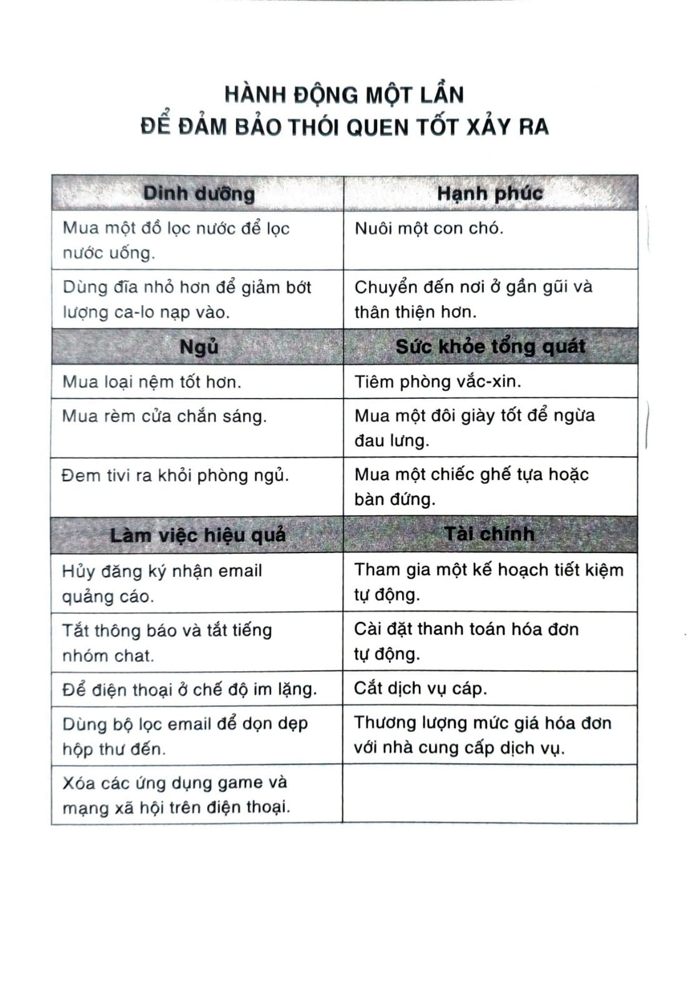
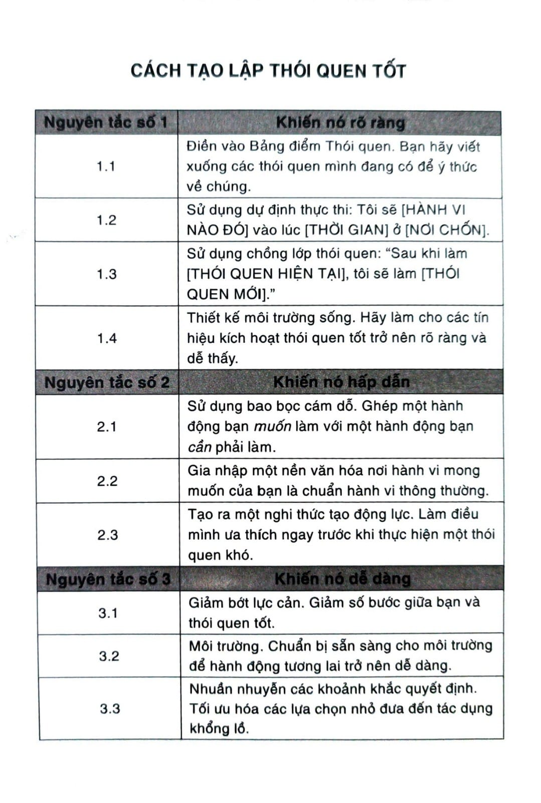
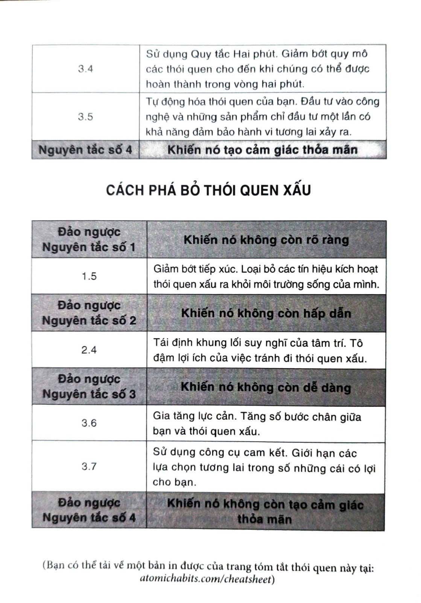

# CHƯƠNG 14: BIẾN THÓI QUEN TỐT THÀNH TẤT YẾU VÀ THÓI QUEN XẤU THÀNH BẤT KHẢ

Vào mùa hè năm 1830, Victor Hugo phải đối mặt với một thời hạn bất khả thi. Trước đó mười hai tháng, vị tác giả người Pháp này đã hứa với nhà xuất bản một quyển sách mới. Nhưng thay vì viết, anh đã tiêu tốn cả năm vào các dự án khác, tiếp đãi khách khứa, và trì hoãn công việc. Rất bực bội, nhà xuất bản của Hugo đã phản ứng bằng cách đặt ra một thời hạn trong vòng sáu tháng tới. Quyển sách cần được hoàn thành trước tháng 2 năm 1831.

Hugo đặt ra một kế hoạch lạ lùng để hạ gục cái tính trì hoãn của mình. Anh thu thập hết tất cả quần áo của mình và yêu cầu trợ lý khóa vào một cái rương lớn. Anh không còn một mảnh quần áo nào để che thân ngoài một chiếc khăn choàng. Thiếu đồ vận ra đường, anh đã ở trong phòng và viết điên cuồng trong suốt mùa thu và mùa đông năm 1830. Thằng gù Nhà thờ Đức Bà đã được xuất bản sớm hai tuần vào ngày 14 tháng 1 năm 1831.[^62]

Đôi khi thành công không hẳn là làm cho thói quen tốt trở nên dễ dàng, mà có thể là câu chuyện về việc làm cho thói quen xấu trở nên khó khăn. Đây là nghịch đảo của Nguyên tắc số 3 trong Thay đổi Hành vi: Khiến nó khó khăn. Nếu bạn thấy bản thân mình liên tục vật vã chạy theo kế hoạch của mình, thì bạn cần phải lấy kinh nghiệm từ Victor Hugo và khiến cho các thói quen của mình trở nên khó nhằn, bằng một kỹ thuật mà các nhà tâm lý học gọi là công cụ cam kết.

Công cụ cam kết là một lựa chọn bạn thực hiện trong hiện tại và kiểm soát hành động của bạn trong tương lai. Đó là cách đảm bảo hành vi tương lai xảy ra, nối bản thân với thói quen tốt và hạn chế thói quen xấu. Khi Victor Hugo giấu quần áo đi nơi khác để có thể tập trung viết, anh đang tạo ra một công cụ cam kết.[^63]

Có nhiều cách tạo ra công cụ cam kết. Bạn có thể giảm ăn quá độ bằng cách mua thực phẩm đóng trong các gói riêng lẻ thay vì gói to. Bạn có thể tự nguyện yêu cầu được đưa vào danh sách bị cấm của sòng bài và các trang chơi bài trên mạng để phòng ngừa các cơn đỏ đen trong tương lai. Tôi còn nghe kể về các vận động viên phải “giữ cân” cho thi đấu đã chọn bỏ ví tiền ở nhà trong tuần đo hạng cân, để né cám dỗ mua thức ăn nhanh.

Một ví dụ khác, bạn tôi, đồng nghiệp và là một chuyên gia về thói quen, Nir Eyal đã mua một đồng hồ hẹn giờ nguồn điện, là một bộ chuyển đổi nối thiết bị định tuyến internet với ổ cắm điện. Vào 10 giờ tối mỗi đêm, bộ hẹn giờ sẽ ngắt điện bộ định tuyến. Khi internet bị ngắt, mọi người đều hiểu là đã đến giờ đi ngủ.

Công cụ cam kết hữu dụng bởi vì chúng cho phép bạn hưởng lợi từ dự định tốt trước khi bạn trở thành nạn nhân của cám dỗ. Ví dụ bất cứ khi nào tôi muốn cắt giảm ca-lo, tôi sẽ yêu cầu người phục vụ chia bữa ăn của mình thành hai phần và đóng gói nửa phần đem đi trước khi phần ăn được dọn lên. Nếu tôi đợi đến khi phần ăn đã lên bàn và tự nhủ “Mình chỉ ăn phân nửa thôi”, thì sẽ chẳng có tác dụng gì.

Chìa khóa nằm ở chỗ điều chỉnh nhiệm vụ sao cho để ra khỏi thói quen tốt thì đòi hỏi nhiều nỗ lực hơn là bắt đầu nó. Nếu bạn đang cảm thấy có động lực rèn luyện để giữ dáng, hãy lên lịch ngay một buổi tập yoga và trả tiền trước. Nếu bạn hào hứng muốn bắt đầu một chuyện làm ăn, hãy gửi email cho doanh nghiệp mà bạn coi trọng và đặt một cuộc gọi tư vấn liền. Khi đến lúc phải hành động, cách duy nhất để rút lui là phải hủy cuộc hẹn, sẽ cần nhiều nỗ lực cộng với tốn tiền.

Công cụ cam kết gia tăng khả năng bạn sẽ làm điều đúng đắn trong tương lai bằng cách khiến cho thói quen xấu trở nên khó khăn trong hiện tại. Tuy nhiên, ta còn có thể làm tốt hơn nữa. Chúng ta có thể biến thói quen tốt thành tất yếu và thói quen xấu thành bất khả.

## LÀM SAO ĐỂ TỰ ĐỘNG HÓA MỘT THÓI QUEN VÀ KHÔNG BAO GIỜ PHẢI LĂN TĂN VỀ NÓ NỮA

John Henry Patterson sinh ra ở Dayton, Ohio, vào năm 1844. Ông mất cả thời thơ ấu vào những việc đều đặn nhàm chán ở nông trại gia đình và làm việc theo ca ở nhà máy cưa của cha mình. Sau khi học đại học ở Dartmouth, Patterson trở về Ohio và mở một cửa hàng bán tạp hóa nhỏ cho thợ mỏ than.

Tựa hồ như đó là một cơ hội béo bở. Cửa hàng gặp rất ít cạnh tranh và có một lượng khách hàng ổn định, nhưng tiền kiếm được vẫn rất chật vật. Đó là lúc Patterson phát hiện ra nhân viên của mình ăn cắp tiền.

Giữa những năm 1800, nhân viên ăn cắp là một vấn nạn phổ biến. Biên lai được cất trong tủ kéo, rất dễ bị thay đổi hay vứt bỏ. Không có camera quan sát để giám sát hành vi và không có phần mềm nào để theo dấu giao dịch. Trừ phi bạn sẵn lòng đi tò tò theo nhân viên của mình từng giây từng phút, hoặc tự mình quản lý mọi cuộc mua bán, không thì rất khó có thể ngăn ngừa trộm cắp.

Trong lúc Patterson đau đầu suy nghĩ về tình hình gay go của mình, ông bắt gặp mẩu quảng cáo về một phát minh mới gọi là Két tiền chống gian lận của Ritty[^64]. Do James Ritty - một đồng hương Dayton - thiết kế ra, đây là chiếc máy tính tiền đầu tiên. Chiếc máy tự động khóa tiền mặt và biên lai vào trong ngăn kéo sau mỗi lần giao dịch. Patterson mua hai chiếc với giá năm mươi đô-la một chiếc.

Vấn nạn nhân viên trộm tiền ở cửa hàng của ông biến mất trong một đêm. Trong sáu tháng tiếp theo, cửa hàng của Patterson từ tình trạng mất tiền chuyển sang có lợi nhuận 5.000 đô-la - tương đương hơn 100.000 đô-la thời giá bây giờ.

Patterson quá ấn tượng với chiếc máy đến mức ông chuyển ngành kinh doanh. Ông mua lại quyền sử dụng sáng chế của Ritty và mở công ty Máy tính tiền Quốc gia[^65]. Mười năm sau, Máy tính tiền Quốc gia đã có trên một ngàn nhân viên và đang trên con đường trở thành một trong những doanh nghiệp thành công nhất thời bấy giờ.

Cách tốt nhất để xóa bỏ một thói quen xấu là khiến việc thực hiện nó trở nên không thực tế. Gia tăng lực cản cho đến khi bạn thậm chí còn không được lựa chọn hành động. Điểm sáng giá của chiếc máy tính tiền là nó tự động hóa hành vi đạo đức bằng cách làm cho hành vi trộm cắp trở nên bất khả thi trong thực tế. Thay vì cố gắng thay đổi nhân viên, nó làm cho hành vi mong muốn trở nên tự động.

Một vài hành động - như lắp đặt một máy tính tiền chẳng hạn - xứng đáng với giá trị bỏ ra. Những lựa chọn một lần duy nhất này đòi hỏi một ít nỗ lực lúc ban đầu nhưng sẽ tạo ra giá trị theo thời gian. Tôi rất phấn khích với ý tưởng một lựa chọn đơn lẻ ban đầu có thể tạo ra lợi ích lâu bền về sau, và tôi đã khảo sát độc giả về những hành động một lần duy nhất đã dẫn họ đến các thói quen dài hạn tốt hơn. Bảng trong trang kế sẽ chia sẻ một vài câu trả lời phổ biến.

Tôi dám cá nếu một người trung bình chỉ cần thực hiện phân nửa số hành động một lần duy nhất trong danh sách này thôi - ngay cả khi họ không hề suy nghĩ về thói quen của mình đi chăng nữa - thì chắc chắn một năm nữa họ sẽ thấy mình đang sống một đời sống tốt hơn bây giờ. Các hành động một lần này là cách ứng dụng trực tiếp Nguyên tắc số 3 trong Thay đổi Hành vi. Chúng khiến ta ngủ ngon, ăn uống lành mạnh, làm việc hiệu quả hơn, tiết kiệm tiền, và nhìn chung, có một đời sống lành mạnh trở nên dễ dàng hơn bao giờ hết.

Tất nhiên, có rất nhiều cách để tự động hóa thói quen tốt và bỏ đi thói quen xấu. Thông thường, công nghệ sẽ được ứng dụng để phục vụ bạn. Công nghệ có thể chuyển hóa các hành động khó khăn, vất vả và phức tạp trở thành hành vi dễ dàng, đơn giản và dễ chịu. Đó là cách hiệu quả và đáng tin nhất đảm bảo hành vi đúng sẽ xảy ra.

Điều này đặc biệt hữu dụng đối với các hành vi quá hiếm hoi đến mức khó có thể trở thành thói quen. Những thứ bạn thực hiện một tháng hoặc một năm một lần - chẳng hạn như cân đối hồ sơ đầu tư - không được tái diễn đủ thường xuyên để trở thành một thói quen, cho nên các thói quen này đặc biệt có lợi nếu để cho công nghệ “ghi nhớ” giùm bạn.

Các ví dụ khác: Thuốc men: Đơn thuốc có thể được điền đầy đủ tự động. Tài chính cá nhân: Người đi làm có thể tiết kiệm dành cho hưu trí bằng cách đăng ký tự động trích từ lương. Nấu nướng: Dịch vụ giao hàng có thể đi chợ giùm bạn. Hiệu suất: Có thể giảm việc lướt mạng xã hội bằng một phần mềm chặn truy cập trang web.

Bạn tự động hóa cuộc sống của mình càng nhiều thì bạn càng có nhiều sức lực tập trung vào những công tác mà máy móc chưa thực hiện được. Mỗi một thói quen ta trao quyền cho công nghệ có thể giải phóng thời gian và năng lượng cho ta đổ vào giai đoạn phát triển tiếp theo. Như nhà toán học và là triết gia Alfred North Whitehead từng viết, “Văn minh có thể tiến bộ là nhờ mở rộng số lượng hoạt động ta có thể làm được mà không cần suy nghĩ.”

Dĩ nhiên sức mạnh của công nghệ cũng có thể chống lại ta. Xem tivi quá độ trở thành thói quen bởi vì bạn cần nhiều nỗ lực để ngừng nhìn vào màn hình hơn là tiếp tục. Thay vì phải nhấn một cái nút để xem tập tiếp theo thì Netflix hay YouTube sẽ tự động chạy cho bạn. Bạn chỉ việc mở mắt mà xem.

Công nghệ tạo ra một mức độ tiện lợi cho phép bạn sinh hoạt chỉ với nỗ lực và khao khát nhỏ nhất. Chỉ hơi thấy tín hiệu đói một chút là bạn có thể gọi thức ăn giao đến tận nhà. Chỉ hơi chán một chút là bạn có thể lạc lối với thế giới rộng lớn của mạng xã hội. Khi nỗ lực cần thiết đòi hỏi để hành động cho cơn thèm muốn của mình chỉ còn là số không, bạn sẽ thấy bản thân mình trượt dài vào trong bất kỳ xung động nào nổi lên vào lúc đó. Mặt trái của sự tự động hóa là chúng ta có thể thấy bản thân mình nhảy từ nhiệm vụ đơn giản này sang nhiệm vụ đơn giản khác mà không dành thời giờ cho những việc khó hơn, nhưng nhiều phần thưởng hơn.

Tôi phát hiện thấy mình thường hay sa đà vào mạng xã hội mỗi khi xuống tinh thần. Chỉ cần thấy chán trong tích tắc thôi là tôi chộp lấy điện thoại ngay. Thật dễ dàng gọi các sao nhãng tí hon này là “chỉ tạm nghỉ một lát”, nhưng theo thời gian chúng có thể tích tụ thành một vấn đề nghiêm trọng hơn. Cứ liên tục kéo dài “thêm một phút nữa thôi” có thể ngăn tôi làm bất cứ điều gì tiếp theo. (Không phải chỉ có mình tôi. Một người trung bình tốn khoảng hai tiếng mỗi ngày cho mạng xã hội. Bạn có thể làm gì nếu có thêm sáu trăm giờ mỗi năm?)

Trong suốt một năm tôi viết quyển sách này, tôi đã thử nghiệm một chiến lược quản lý thời gian mới. Mỗi sáng thứ Hai hằng tuần, trợ lý của tôi sẽ cài đặt lại mật khẩu trên toàn bộ tài khoản mạng xã hội của tôi, khiến tôi đăng thoát khỏi mọi thiết bị. Thế là suốt tuần tôi có thể làm việc tập trung không sao nhãng. Đến thứ Sáu, cô ấy sẽ gửi mật khẩu mới cho tôi. Tôi có toàn bộ cuối tuần tận hưởng mọi thứ trên mạng xã hội cho đến sáng thứ Hai tiếp theo cô ấy lại đổi mật khẩu. (Nếu bạn không có một trợ lý, hãy lập đội với một người bạn hoặc người thân, và đổi mật khẩu cho nhau mỗi tuần.)

Một trong các kinh ngạc lớn nhất tôi nhận ra đó là mình thích ứng rất nhanh. Chỉ trong tuần đầu tiên khóa mình khỏi các mạng xã hội, tôi phát hiện mình không có nhu cầu kiểm tra ứng dụng thường xuyên như trước đây, và chắc chắn tôi không cần nó mỗi ngày. Nó trở nên dễ dàng đến mức đã thành mặc định. Một khi thói quen xấu trở nên bất khả, tôi phát hiện ra mình thực sự có động lực làm những việc khác có ý nghĩa hơn. Sau khi tôi loại bỏ món ngọt tinh thần ra khỏi môi trường của mình, thật dễ dàng chọn ăn những thứ lành mạnh.

Khi làm việc vì lợi ích của bạn, sự tự động hóa có thể làm cho thói quen tốt trở nên không thể cưỡng lại và thói quen xấu thành bất khả. Đó là cách để đảm bảo hành vi tương lai của mình thay vì chỉ trông chờ vào sức mạnh ý chí tại lúc đó. Bằng cách tối ưu hóa các công cụ cam kết, các quyết định một lần mang tính chiến lược, và sử dụng công nghệ, bạn có thể tạo ra một môi trường không thể nào không xảy ra - một không gian nơi thói quen tốt không chỉ là kết quả đầu ra bạn mong muốn, mà còn là kết quả được đảm bảo chắc chắn.

## Tóm tắt chương

- Đảo ngược của Nguyên tắc số 3 trong Thay đổi Hành vi là khiến nó không còn dễ dàng.

- Công cụ cam kết là một lựa chọn bạn thực hiện trong hiện tại và kiểm soát hành động của bạn trong tương lai.

- Cách tối ưu để khóa lại hành vi tương lai là tự động hóa thói quen của bạn.

- Lựa chọn một lần duy nhất - chẳng hạn như mua một chiếc nệm tốt hơn hay ghi danh vào một kế hoạch tiết kiệm tự động - là các hành động đơn lẻ có thể tự động hóa thói quen tương lai của bạn và tạo ra lợi ích tăng tiến theo thời gian.

- Sử dụng công nghệ để tự động hóa thói quen là cách hiệu quả và đáng tin nhất để đảm bảo hành vi đúng đắn sẽ xảy ra.

---

## Chú thích

[^62]: Thật trớ trêu là câu chuyện này giống với quá trình tôi viết quyển sách này đến mức vẫn còn in mãi trong đầu tôi. Mặc dù  nhà xuất bản của tôi dễ tính hơn rất rất nhiều, và tủ đồ của tôi vẫn còn đó, nhưng mà tôi thực sự đã cảm thấy bản thân phải nhốt mình trong nhà thì mới hoàn thành được bản thảo. (TG)

[^63]: Còn được gọi là “hiệp ước Ulysses” hay “hợp đồng Ulysses”. Được đặt theo tên Ulysses, nhân vật anh hùng trong trường thiên The Odyssey, người đã bảo thủy thủ trói mình vào cột buồm để khi chàng nghe thấy bài ca của các nàng Siren (mỹ nhân ngư), chàng không thể bẻ bánh lái về phía họ và đâm vào đá. Ulysses nhận ra lợi ích của việc khóa lại hành động tương lai lúc tâm trí mình còn đang hoạt động tốt, thay vì đợi đến khi dục vọng đẩy mình vào khoảnh khắc quyết định. (TG)

[^64]: Ritty's Incorruptible Cashier.

[^65]: National Cash Register Company.
