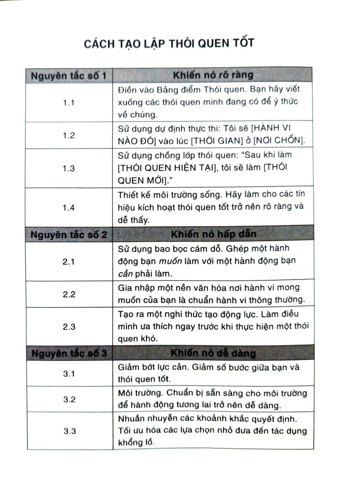
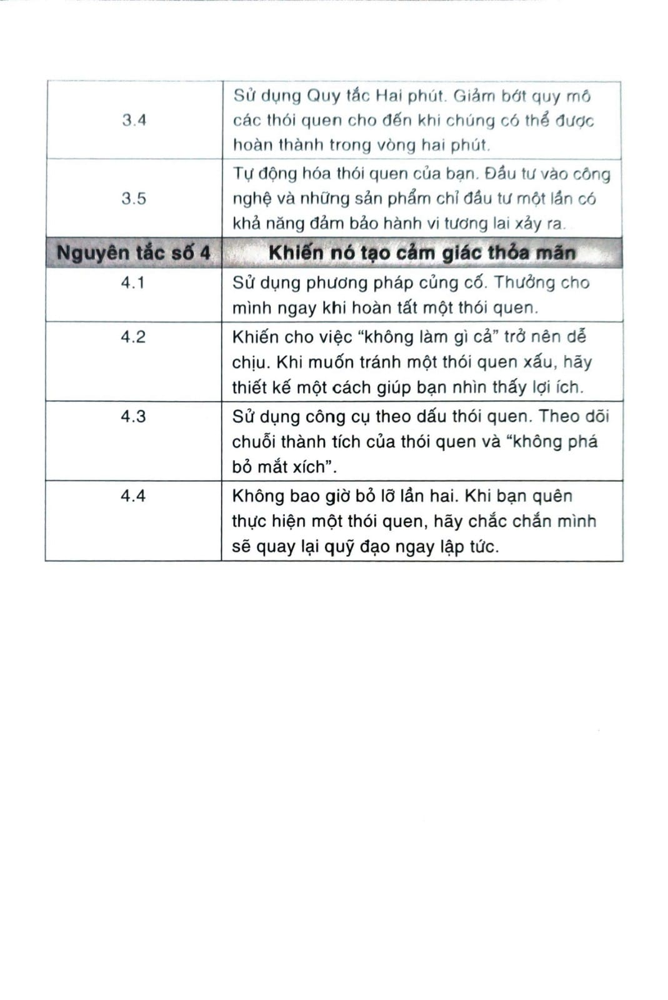
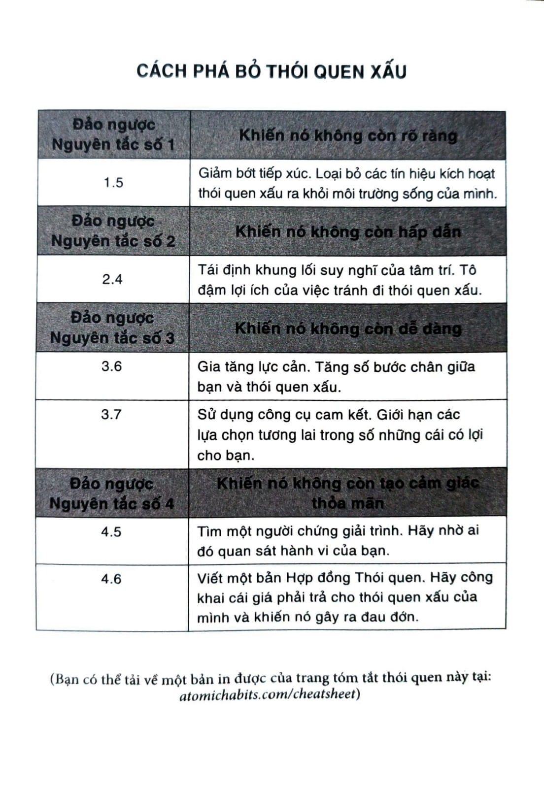

# CHƯƠNG 17: TRÁCH NHIỆM GIẢI TRÌNH CÓ THỂ THAY ĐỔI MỌI THỨ

Sau khi phục vụ ở vai trò phi công trong Chiến tranh thế giới lần II, Roger Fisher theo học trường luật Harvard và dành ba mươi bốn năm của đời mình để chuyên môn hóa trong lĩnh vực đàm phán và quản lý xung đột. Ông sáng lập Dự án Đàm phán Harvard[^73] và hợp tác với nhiều quốc gia cũng như các nhà lãnh đạo thế giới về giải pháp hòa bình, khủng hoảng con tin và đàm phán ngoại giao. Thế nhưng đó là những năm 1970 và 1980, khi mối đe dọa từ chiến tranh hạt nhân đang leo thang, cái mà Fisher đang phát triển có lẽ chỉ thú vị với riêng ông vào thời ấy.

Lúc ấy, Fisher tập trung thiết kế các chiến lược có thể ngăn chặn chiến tranh hạt nhân, và ông nhận ra một sự thật đáng ngại. Bất kỳ vị Tổng thống đương nhiệm nào cũng có quyền truy cập vào mã phóng bom có uy lực giết chết hàng triệu con người, nhưng chưa từng thực sự nhìn thấy ai chết bởi lẽ lúc nào ông ấy cũng đang cách nơi ấy hàng ngàn cây số.

“Đề xuất của tôi khá đơn giản”, ông viết vào năm 1981. Đặt mã số (hạt nhân) vào một viên nang nhỏ, sau đó cấy nó vào trong ngực một người tình nguyện, ngay bên cạnh trái tim. Người tình nguyện viên sẽ mang theo bên mình một con dao to nặng khi anh đi cùng Tổng thống. Nếu có lúc nào đó Tổng thống muốn khai hỏa vũ khí hạt nhân, cách duy nhất đó là chính tay ông đầu tiên phải giết một người trước. Viên Tổng thống sẽ nói, “George, tôi xin lỗi nhưng mười triệu người phải chết.” Ông phải nhìn vào mắt người đó và nhận thức rõ về cái chết - cái chết của một người vô tội. Máu sẽ đổ trên tấm thảm Nhà Trắng. Hiện thực trước mắt sẽ làm rõ vấn đề.

“Khi tôi đề xuất điều này với bạn bè ở Lầu Năm Góc, họ bảo, “Chúa ơi, thật kinh khủng. Phải xuống tay giết ai đó sẽ bóp méo đánh giá của Tổng thống. Ông ấy hẳn là sẽ chẳng bao giờ bấm nút đâu.”

Qua cuộc thảo luận về Nguyên tắc số 3 trong Thay đổi Hành vi, chúng ta đã bàn về tầm quan trọng của việc làm cho thói quen tốt ngay lập tức tạo cảm giác thỏa mãn. Đề nghị của Fisher là đảo ngược của Nguyên tắc số 4: Khiến nó không còn ngay lập tức tạo cảm giác thỏa mãn.

Cũng giống như ta thường sẽ lặp đi lặp lại một trải nghiệm khi đoạn cuối của nó tạo cảm giác thỏa mãn, ta cũng có xu hướng tránh các trải nghiệm có kết cuộc khó chịu. Cảm giác đau đớn là người thầy hiệu quả. Nếu một thất bại làm ta đau, ta sẽ điều chỉnh. Nếu một thất bại không đau đớn mấy, nó sẽ bị bỏ qua. Một sai lầm đưa đến hậu quả càng tức thời và càng đắt giá bao nhiêu, thì bạn sẽ càng học được bài học nhanh bấy nhiêu. Nguy cơ bị một đánh giá xấu buộc người thợ sửa ống nước phải làm cho tốt việc của mình. Nguy cơ thực khách một đi không trở lại khiến cho nhà hàng phải sáng tạo những món ăn thật ngon. Cái giá của việc cắt sai mạch máu làm cho một bác sĩ phẫu thuật phải nắm vững giải phẫu cơ thể người và thận trọng khi cắt. Khi có hậu quả nghiêm trọng, người ta học nhanh hơn.

Cơn đau càng tức thời, hành vi càng khó xảy ra. Nếu bạn muốn ngăn thói quen xấu và xóa bỏ hành vi kém lành mạnh, thì hãy cho thêm một cái giá phải trả ngay lập tức vào hành động, đó chính là cách hiệu quả nhất để giảm bớt khả năng xảy ra của nó.

Chúng ta lặp đi lặp lại thói quen xấu là vì chúng có ích cho ta theo cách nào đó, và vì vậy mà ta khó từ bỏ. Cách tốt nhất tôi biết để vượt qua tình thế khó khăn này là gia tăng tốc độ bị trừng phạt gắn với hành vi này. Không được có khoảng cách giữa hành động và hậu quả kéo theo.

Ngay khi hành động gây ra một hậu quả ngay lập tức, hành vi bắt đầu thay đổi. Khách hàng thanh toán hóa đơn đúng hạn vì nếu không họ sẽ bị phạt phí trễ hạn. Sinh viên có mặt trên lớp vì điểm số của họ gắn với điểm danh. Chúng ta sẽ nhảy qua rất nhiều vòng để tránh những cơn đau tức thời như vậy.

Đương nhiên điều này cũng có mặt hạn chế. Nếu bạn cậy nhờ vào hình phạt để thay đổi hành vi, thì cường độ của hình phạt phải tương xứng với độ lớn của hành vi mà nó muốn điều chỉnh. Để có thể hiệu quả, cái giá của việc trì hoãn phải lớn hơn cái giá của hành động. Để khỏe mạnh, cái giá của sự lười phải to hơn cái giá của rèn luyện. Bị phạt vì hút thuốc trong nhà hàng hoặc không phân loại rác gắn thêm hậu quả cho một hành động. Hành vi chỉ thay đổi khi hình phạt đủ đau đớn và chắc chắn được thi hành.

Nhìn chung, hậu quả càng cục bộ, rõ ràng, cụ thể và tức thời, thì càng có khả năng ảnh hưởng đến hành vi của một cá nhân. Hậu quả càng rộng, mơ hồ và chậm đến bao nhiêu thì khả năng ảnh hưởng đến hành vi của một cá nhân thấp bấy nhiêu.

May thay, có một cách trực tiếp tăng thêm cái giá phải trả cho mỗi thói quen xấu: Tạo ra một Hợp đồng Thói quen.

## HỢP ĐỒNG THÓI QUEN

Đạo luật về thắt dây an toàn được thông qua vào ngày 1 tháng 12 năm 1984 ở New York. Vào lúc đó, chỉ 14% người Mỹ thường xuyên thắt dây an toàn - nhưng điều ấy sắp thay đổi hoàn toàn.

Trong vòng năm năm, hơn phân nửa nước Mỹ đã có điều luật thắt dây an toàn. Ngày nay, thắt dây an toàn là bắt buộc theo luật ở bốn mươi chín trong năm mươi bang Mỹ. Và không chỉ về mặt lập pháp, số người thắt dây an toàn cũng thay đổi ngoạn mục. Vào năm 2016, hơn 88% người Mỹ cài dây mỗi lần họ bước vào trong xe. Chỉ trong hơn ba mươi năm, đã có một sự đảo ngược tình hình hoàn toàn trong thói quen của hàng triệu người.

Luật và quy định là ví dụ về việc chính phủ có thể thay đổi thói quen bằng cách tạo ra hợp đồng xã hội. Trong tư cách một xã hội, chúng ta đồng thuận với nhau tuân theo những luật lệ nhất định và thực thi chúng như một nhóm. Bất cứ khi nào một khoản luật tác động lên hành vi - như luật thắt dây an toàn, luật cấm hút thuốc trong nhà hàng, luật tái chế rác bắt buộc - thì nó chính là ví dụ về cái cách hợp đồng xã hội định hình thói quen của chúng ta. Cả nhóm đồng ý sẽ hành động theo một cách thức nhất định, và nếu bạn không tuân theo, bạn sẽ bị phạt.

Cũng giống như chính phủ dùng luật để giữ cho công dân hành xử có trách nhiệm, bạn cũng có thể tạo ra một Hợp đồng Thói quen để giữ cho bản thân có trách nhiệm. Hợp đồng Thói quen là một thỏa thuận miệng hay bằng văn bản trong đó bạn nêu lên cam kết của mình đối với một thói quen nhất định và hình phạt đi kèm nếu bạn không tuân theo. Sau đó bạn sẽ tìm một hoặc hai người thực hiện vai trò như người mà mình có trách nhiệm giải trình[^74] và cùng ký vào hợp đồng với bạn.

Bryan Harris, một doanh nhân từ Nashville, Tennessee, là người đầu tiên tôi biết đã thực thi chiến lược này trong thực tế. Không bao lâu sau sinh nhật của con trai mình, Harris nhận ra mình cần phải giảm vài kí-lô. Anh thảo một bản hợp đồng giữa mình, vợ, và huấn luyện viên cá nhân của mình. Bản đầu tiên viết như sau, “Mục tiêu #1 của Bryan trong Quý 1 năm 2017 là bắt đầu ăn uống điều độ trở lại để cảm thấy khoan khoái hơn, trông mạnh khỏe hơn, và có thể đạt được mục tiêu dài hạn của mình là số cân 100 kí-lô với 10% mỡ cơ thể.”

Bên dưới tuyên bố, Harris vẽ ra lộ trình đạt tới kết quả lý tưởng: Pha #1: Trở lại chế độ ăn kiêng “ít-năng-lượng” nghiêm ngặt trong Quý 1. Pha #2: Khởi động chương trình theo dõi dinh dưỡng vĩ mô trong Quý 2. Pha #3: Tinh chỉnh và duy trì cụ thể chế độ ăn kiêng cũng như luyện tập trong Quý 3.

Cuối cùng, anh viết ra các thói quen hằng ngày có thể giúp anh vươn tới mục tiêu. Ví dụ, “Ghi lại tất cả thực phẩm đã nạp vào người mỗi ngày, và cân mỗi ngày.”

Sau đó anh liệt kê các hình phạt nếu thất bại: “Nếu Bryan không thực hiện hai điều này thì hậu quả sau sẽ áp xuống: Anh ấy sẽ phải ăn mặc trang trọng vào mỗi ngày đi làm và mỗi sáng Chủ nhật trong suốt quý đó. Ăn mặc trang trọng được định nghĩa là không mặc quần jean, áo thun, áo hoodie, hay quần đùi. Anh ấy cũng phải đưa cho Joey (huấn luyện viên) 200 đô-la khi Joey phát hiện vi phạm nếu anh ấy bỏ lỡ một ngày ghi nhật ký ăn uống.”

Vào cuối trang, Harris, vợ anh và huấn luyện viên cùng ký hợp đồng.

Phản ứng đầu tiên của tôi khi thấy hợp đồng này là dường như nó hơi quá nghiêm trọng và không cần thiết, đặc biệt là phần ký tên. Nhưng Harris thuyết phục tôi rằng ký tên trên hợp đồng là dấu chỉ của sự nghiêm túc. “Hễ mà tôi bỏ phần này”, anh bảo, “là y như rằng tôi lười ngay”.

Ba tháng sau đó, sau khi đạt được mục tiêu của Quý 1, Harris nâng cấp mục tiêu của mình. Hậu quả cũng tăng theo. Nếu anh bỏ lỡ mục tiêu về carbohydrate và chất đạm, anh ấy sẽ phải đưa cho huấn luyện viên 100 đô-la. Và nếu anh không cân, anh phải đưa vợ 500 đô-la nếu chị phát hiện vi phạm. Và có lẽ hình phạt đau nhất chính là, nếu anh quên không chạy bộ, anh phải mặc trang trọng đi làm mỗi ngày và đội một chiếc mũ Alabama trong hết quý đó - một sự phản bội cay đắng đối với đội Auburn yêu quý của anh.

Chiến lược này có hiệu quả. Với vợ và huấn luyện viên trong vai trò người làm chứng và với bản hợp đồng nêu rõ chính xác những gì cần làm mỗi ngày, Harris thật đã giảm cân.[^75]

Để làm cho thói quen xấu không còn tạo thỏa mãn, lựa chọn tốt nhất của bạn là làm cho nó gây ra đau đớn tại khoảnh khắc ấy. Tạo ra một Hợp đồng Thói quen là cách trực tiếp làm được việc đó.

Ngay cả khi bạn không muốn viết một bản hợp đồng đáng nể như vậy, thì chỉ cần có một người làm chứng mà bạn có trách nhiệm giải trình thôi cũng đủ hiệu quả. Diễn viên hài Margaret Cho mỗi ngày sẽ viết một bài hát hay một truyện cười. Cô thực hiện thử thách “mỗi ngày một bài hát” với một người bạn, giúp cả hai làm chứng cho nhau. Biết rằng có ai đó đang quan sát có thể là một động lực khá mạnh. Bạn ít có khả năng trì hoãn hay bỏ cuộc bởi cái giá phải trả ngay lúc đó. Nếu bạn không tuân theo, họ có lẽ sẽ nghĩ bạn không đáng tin cậy hoặc lười biếng. Thế là đột nhiên, bạn không những thất bại trong việc giữ vững lời hứa với bản thân, mà còn không giữ được lời hứa với người khác.

Bạn còn có thể tự động hóa quá trình này. Thomas Frank, một doanh nhân từ Boulder, Colorado, thức dậy mỗi sáng vào lúc 5:55. Và nếu anh không làm thế, anh có một dòng tweet được lên lịch đăng tự động có nội dung như sau: “Bây giờ là 6:10 và tôi chưa dậy vì tôi lười! Hãy trả lời bên dưới để được nhận 5 đô-la qua PayPal (giới hạn 5 người), trừ trường hợp báo thức của tôi bị hư.”

Chúng ta luôn cố gắng thể hiện cái tôi đẹp nhất của mình ra với thế giới. Ta chải đầu và đánh răng, ăn mặc cẩn thận vì ta biết các thói quen này dễ nhận được phản ứng tích cực. Chúng ta muốn có điểm cao và tốt nghiệp từ các trường hàng đầu để gây ấn tượng với các người chủ tiềm năng, người phối ngẫu, bạn bè và gia đình. Chúng ta quan tâm đến cách nghĩ của người xung quanh vì nó cho biết liệu người khác có thích mình không. Đây chính xác là lý do vì sao có một người chứng giải trình hoặc ký một bản Hợp đồng Thói quen lại hiệu quả như vậy.

## Tóm tắt chương

- Đảo ngược của Nguyên tắc số 4 trong Thay đổi Hành vi là khiến nó không còn tạo cảm giác thỏa mãn.

- Chúng ta ít có xu hướng lặp lại một thói quen xấu nếu nó gây đau đớn hoặc không tạo cảm giác thỏa mãn.

- Một người chứng giải trình có thể tạo ra một cái giá phải trả tức thời nếu ta không hành động. Chúng ta quan tâm sâu sắc đến những gì người khác nghĩ về ta, và ta không muốn người khác có quan điểm không tốt về mình.

- Một Hợp đồng Thói quen có thể được dùng để làm tăng thêm cái giá phải trả cho bất kỳ hành vi nào. Bản hợp đồng công khai cái giá khi bạn vi phạm lời hứa và khiến nó gây ra đau đớn.

- Biết rằng có ai đó đang quan sát có thể là một động lực khá mạnh.

---

## Chú thích

[^73]: Harvard Negotiation Project.

[^74]: Accountability partner.

[^75]: Bạn có thể xem bản Hợp đồng Thói quen của chính Bryan Harris và tải một mẫu trống ở trang atomichabits.com/contract. (TG)
