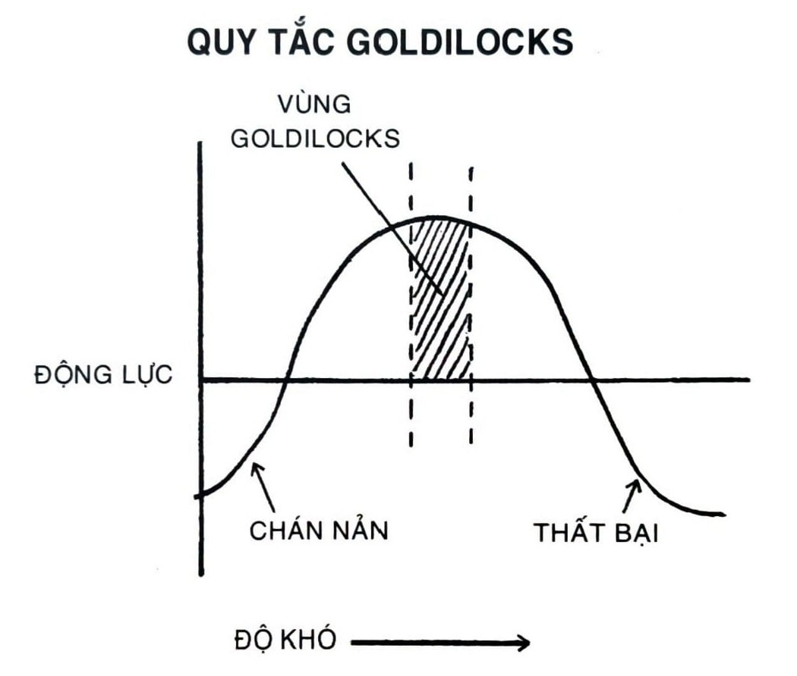

# CHƯƠNG 19: QUY TẮC GOLDILOCKS: DUY TRÌ ĐỘNG LỰC TRONG ĐỜI SỐNG VÀ CÔNG VIỆC

Vào năm 1955, Disneyland vừa mới mở cửa ở Anaheim, California, thì một cậu bé mười tuổi bước vào hỏi xin việc. Lúc bấy giờ luật lao động khá là lỏng lẻo nên cậu bé đã xoay xở để có được vị trí bán sách hướng dẫn với giá 0,50 đô-la một cuốn.

Trong vòng một năm, cậu được chuyển qua gian hàng ảo thuật của Disney, nơi cậu được học các mánh lới từ các nhân viên đàn anh. Cậu thử nghiệm các mẩu chuyện cười và thử các tiết mục thường lệ với khách ghé thăm. Không lâu sau cậu phát hiện ra điều cậu thích làm không phải là biểu diễn ảo thuật mà là nghệ thuật biểu diễn nói chung. Cậu bắt đầu phóng tầm nhìn trở thành một diễn viên hài.

Bắt đầu từ những năm thiếu niên, cậu trai trẻ biểu diễn trong các hộp đêm nhỏ quanh Los Angeles, với đám đông nhỏ và tiết mục ngắn. Anh ít khi ở trên sân khấu quá năm phút. Phần đông mọi người đều không chú ý, họ đang bận uống rượu hoặc nói chuyện với bạn bè. Có một đêm, anh còn trình bày màn hài độc diễn của mình trước một câu lạc bộ trống trơn, theo đúng nghĩa đen.

Đó không phải là một công việc vinh quang, nhưng hiển nhiên là anh đang giỏi lên từng ngày. Tiết mục đầu tiên của anh chỉ kéo dài khoảng một hai phút. Đến khi bước vào trường trung học, chất liệu của anh đã mở rộng ra thành một màn năm phút, và chỉ ít năm sau là một show mười phút. Vào tuổi mười chín, anh đã biểu diễn hàng tuần cho hai mươi phút một lần diễn. Có lúc anh đã phải đọc ba bài thơ trong một show để kéo dài màn diễn cho đủ thời gian, nhưng kỹ thuật của anh càng ngày càng tiến bộ.

Anh bỏ ra thêm một thập kỷ để thử nghiệm, điều chỉnh và thực hành. Anh nhận việc làm cây viết chương trình truyền hình và dần dần anh đã có thể bắt đầu xuất hiện trên các talk show. Vào giữa thập niên 1970, anh đã thăng tiến trở thành khách mời thường xuyên trên chương trình The Tonight Show và Saturday Night Live.

Cuối cùng, sau gần mười lăm năm làm việc, chàng trai trẻ trở nên nổi tiếng. Anh thực hiện một tour lưu diễn sáu mươi thành phố trong sáu mươi ba ngày. Rồi một tour bảy mươi hai thành phố trong tám mươi ngày. Rồi sau đó là một tour tám mươi lăm thành phố trong chín mươi ngày. Anh có 18.695 khán thính giả tham dự một show ở Ohio. Một show ba ngày khác ở New York đã bán hết 45.000 vé. Anh vọt lên đứng đầu trong thể loại mình đeo đuổi và trở thành một trong những danh hài thành công nhất thời của mình.

Tên anh là Steve Martin.

Câu chuyện của Martin cho thấy một góc nhìn tuyệt diệu về những tố chất cần thiết để duy trì lâu dài một thói quen. Hài kịch không dành cho người nhút nhát. Thật khó hình dung ra tình huống nào có thể làm nhiều người kinh hãi cho bằng diễn hài một mình trên sân khấu mà không một ai cười. Vậy mà Steve Martin đã đối mặt với nỗi sợ này mỗi tuần trong suốt mười tám năm. Theo lời ông viết, “10 năm học hỏi, 4 năm mài giũa, và 4 năm thành công rực rỡ.”

Vì sao có một số người, như Martin, có thể kiên trì với thói quen của mình - dù là tập viết những mẩu chuyện cười, vẽ truyện tranh hay chơi đàn guitar - trong khi phần đông chúng ta vất vả duy trì động lực? Làm thế nào để thiết kế các thói quen có thể giữ vững lâu bền chứ không phải tàn lụi đi? Các nhà khoa học đã nghiên cứu vấn đề này rất nhiều năm. Trong khi vẫn còn phải tìm hiểu nhiều thứ, một trong số các phát hiện nhất quán cho thấy cách để duy trì động lực và đạt tới mức độ khát vọng đỉnh cao là làm việc trên các nhiệm vụ “có độ khó vừa đủ xoay xở”[^84].

Bộ não con người ưa thích thử thách, nhưng chỉ trong mức độ khó tối ưu. Nếu bạn thích tennis và thử chơi một trận nghiêm túc với một đứa bé bốn tuổi, rất nhanh bạn sẽ thấy chán. Nó quá dễ. Bạn sẽ thắng từng điểm một. Ngược lại, nếu bạn đấu với một tay vợt chuyên nghiệp như Roger Federer hay Serena Williams, bạn sẽ nhanh nản bởi trận đấu quá khó.

Giờ hãy tưởng tượng bạn chơi với một đấu thủ ngang tầm. Trong diễn biến trận đấu, bạn sẽ ăn vài điểm và thua vài điểm. Bạn có cơ hội thắng, nhưng chỉ khi bạn thật sự cố gắng. Sức tập trung của bạn gom lại, sao nhãng biến mất, và bạn thấy bản thân đổ 100% sức lực vào trận đấu trước mắt. Đây là thử thách có độ khó vừa đủ xoay xở, và nó chính là ví dụ về Quy tắc Goldilocks.

Quy tắc Goldilocks nói rằng chúng ta trải qua cảm giác có động lực đỉnh điểm khi thực hiện các nhiệm vụ chỉ ở ngay phía trên mức ngưỡng của năng lực hiện tại. Không quá khó. Không quá dễ. Chỉ vừa đúng.

Sự nghiệp diễn hài của Martin là một ví dụ xuất sắc của Quy tắc Goldilocks trong thực tế. Mỗi năm ông đều mở rộng tiết mục hài kịch của mình - nhưng chỉ thêm khoảng một hai phút. Ông luôn thêm chất liệu mới, nhưng ông cũng luôn giữ lại một số chuyện cũ đảm bảo gây cười. Luôn có vừa đủ thắng lợi để giúp ông có động lực và vừa đủ sai lầm để giúp ông luôn nỗ lực làm việc.

Khi bạn khởi động một thói quen, quan trọng là giữ cho hành vi càng dễ càng tốt, để bạn có thể duy trì ngay cả khi điều kiện xung quanh không hoàn hảo. Ta đã thảo luận kỹ lưỡng ý tưởng này khi nói về Nguyên tắc số 3 trong Thay đổi Hành vi.

Tuy nhiên, một khi thói quen đã hình thành, thì quan trọng là tiếp tục tiến bộ từng bước nhỏ. Các cải thiện nhỏ này và các thách thức mới sẽ giúp bạn gắn kết. Và nếu bạn rơi vào đúng Vùng Goldilocks, bạn có để đạt được trạng thái vào guồng[^85].

*Hình 15: Động lực cao nhất xuất hiện khi đối mặt với một thách thức có độ khó vừa đủ xoay xở. Trong nghiên cứu tâm lý học, đây được gọi là Quy luật Yerkes-Dodson, mô tả mức độ kích thích tối ưu là điểm giữa của sự nhàm chán và sự lo âu.*

Trạng thái vào guồng là trải nghiệm “vào trạng thái” và toàn bộ con người ta chìm ngập vào hoạt động. Các nhà khoa học đã cố gắng thử định lượng cảm giác này. Họ phát hiện ra để đạt được trạng thái vào guồng, một nhiệm vụ nên có độ khó tầm khoảng 4% cao hơn năng lực hiện tại của bạn. Trong thực tế chắc chắn sẽ không dễ đo lường độ khó của một hành động theo cách này, nhưng mà ý tưởng cốt lõi của Quy tắc Goldilocks vẫn còn giá trị: Làm việc trên các nhiệm vụ có độ khó vừa đủ - nằm đâu đó trong chu vi năng lực của mình - có vẻ mang tính quyết định đối với duy trì động lực.

Cải thiện đòi hỏi một độ cân bằng tinh tế. Bạn cần phải thường xuyên tìm kiếm thử thách thúc đẩy bạn tiến về giới hạn của mình, đồng thời liên tục tiến bộ vừa đủ để giữ động lực. Hành vi cần được giữ cho mới mẻ để có thể luôn hấp dẫn và thỏa mãn. Thiếu đi tính đa dạng, chúng ta sẽ nhanh chán. Và cơn chán chính là kẻ thù số một trên hành trình cải thiện bản thân.

## CÁCH GIỮ TẬP TRUNG KHI BẠN BẮT ĐẦU CHÁN MỤC TIÊU CỦA MÌNH

Sau khi sự nghiệp bóng chày của tôi kết thúc, tôi đi tìm môn thể thao mới cho mình. Tôi tham gia một đội cử tạ, và ngày nọ có một huấn luyện viên ưu tú ghé thăm phòng tập của chúng tôi. Trong sự nghiệp lâu dài của mình, ông ấy đã làm việc với hàng ngàn vận động viên, có cả vận động viên Olympic. Tôi giới thiệu mình với ông và chúng tôi bắt đầu nói về quá trình cải thiện.

“Điểm khác biệt giữa các vận động viên giỏi nhất và những người khác là gì?” Tôi hỏi. “Những người thật sự thành công đã làm gì mà người khác không làm?”

Ông ấy đề cập đến các yếu tố mà có thể bạn đã nghĩ đến: yếu tố di truyền, may mắn, tài năng. Nhưng rồi sau đó ông nói một điều tôi không ngờ: “Ở khía cạnh nào đấy nó phụ thuộc vào việc người ta có thể chịu đựng được sự nhàm chán của việc tập luyện hằng ngày hay không, nâng lên hạ xuống một cục tạ ngày này qua ngày khác.”

Câu trả lời của ông làm tôi bất ngờ bởi vì đó là cách nghĩ khác biệt về đạo đức làm việc. Người ta hay nói muốn hoàn thành mục tiêu thì phải làm cho bản thân “hào hứng”. Dù là kinh doanh hay thể thao, bạn thường nghe những câu đại loại như, “Tất cả phụ thuộc vào niềm đam mê.” Hay, “Bạn phải thật sự muốn nó.” Kết quả là, nhiều người trong chúng ta suy sụp khi ta mất tập trung hay mất động lực, bởi ta cho rằng người thành công có một nguồn đam mê không đáy. Nhưng vị huấn luyện viên này bảo rằng người thật sự thành công cũng cảm thấy thiếu động lực như người khác vậy. Điểm khác biệt là họ vẫn tìm cách có mặt thực hiện đều đặn bất chấp cảm giác nhàm chán.

Tinh thông một cái gì đó cũng đều đòi hỏi luyện tập. Nhưng khi bạn luyện tập càng nhiều, thì nó càng trở nên đáng chán và trở thành nếp thường. Ngay khi các lợi ích ban đầu đã đạt được và ta đã biết được điều gì sắp tới, mối quan tâm của ta bắt đầu giảm đi. Đôi khi nó còn xảy ra nhanh hơn. Bạn chỉ cần đúng giờ đến phòng tập nhiều ngày liên tiếp, hay đúng hạn đăng một vài bài viết trên blog, và rồi thế là có bỏ lỡ mất một ngày cũng không sao cả. Mọi việc đang chạy tốt. Thật dễ hợp lý hóa cho một ngày nghỉ bởi bạn đang trong trạng thái tốt đẹp.

Nguy cơ lớn nhất đối với thành công không phải là thất bại, mà là sự nhàm chán. Chúng ta chán thói quen bởi vì nó không còn làm ta hứng khởi nữa. Ta đoán được kết quả đầu ra. Và khi thói quen của ta trở nên bình thường, chúng ta bắt đầu chệch khỏi quỹ đạo tiến bộ, để tìm kiếm sự mới lạ. Có lẽ đây là lý do vì sao ta rơi vào một vòng tròn bất tận, nhảy hết từ môn rèn luyện này qua môn rèn luyện khác, từ chế độ ăn kiêng này sang chế độ ăn kiêng kia, hết ý tưởng kinh doanh này tới ý tưởng kinh doanh nọ. Ngay khi thấy động lực hơi hơi chìm xuống là ta bắt đầu tìm kiếm chiến lược mới - thậm chí cả khi cái cũ vẫn còn hiệu quả. Như Machiavelli viết, “Loài người khát khao mới lạ đến mức những kẻ đang làm tốt cũng mơ cầu thay đổi nhiều như những kẻ đang làm tệ.”

Hẳn đây là lý do vì sao các sản phẩm có khả năng tạo lập thói quen đều là các sản phẩm cung cấp sự đổi mới liên tục. Phim khiêu dâm cung cấp cảm giác mới lạ về tình dục. Thức ăn vặt cung cấp cảm giác mới lạ về ẩm thực. Mỗi một trải nghiệm đều cung cấp yếu tố bất ngờ liên tục.

Trong tâm lý học, đây được gọi là phần thưởng đa dạng[^86]. Máy xổ số là ví dụ phổ biến nhất trong đời thực. Thỉnh thoảng sẽ có một tay bạc trúng giải độc đắc nhưng không thể dự đoán vào khoảng thời gian nào. Nhịp độ của phần thưởng là khác nhau. Sự đa dạng này dẫn tới một liều dopamine khổng lồ, tăng cường gợi nhớ ký ức, và tăng tốc độ hình thành thói quen.

Phần thưởng đa dạng không tạo ra cơn thèm muốn - nghĩa là, bạn không thể đem một phần thưởng mà người ta không hứng thú ra đưa cho họ vào lúc này hay lúc khác, và hy vọng rằng họ sẽ đổi ý - nhưng đó là cách hiệu quả để khuếch đại cơn thèm muốn mà ta đã trải qua, bởi lẽ phần thưởng đa dạng giảm bớt sự nhàm chán.

Điểm mốc khao khát ngọt ngào ấy xảy ra trong khoảng chia 50/50 giữa thành công và thất bại. Phân nửa thời gian bạn có được cái bạn muốn. Phân nửa còn lại thì không. Bạn cần chỉ vừa đủ “thắng lợi” để cảm thấy hài lòng và vừa đủ “thèm muốn” để cảm thấy khao khát. Đây là một trong các lợi ích của việc làm theo Quy tắc Goldilocks. Nếu bạn đã sẵn hứng thú với một thói quen nào đó, thì làm việc trên các thử thách có độ khó vừa đủ xoay xở là một cách tốt để giữ hứng thú ấy.

Dĩ nhiên, không phải tất cả thói quen đều có một thành tố phần thưởng đa dạng, và bạn cũng sẽ không muốn thế đâu. Nếu Google chỉ thỉnh thoảng mới cho ra kết quả tìm kiếm vừa ý, tôi chắc chắn sẽ nhanh chóng chuyển sang bộ máy tìm kiếm khác. Nếu Uber chỉ đón tôi phân nửa số lần đặt xe, tôi không tin mình sẽ tiếp tục sử dụng dịch vụ đó nữa. Và nếu tôi đánh răng mỗi tối mà năm thì mười họa mới thấy sạch miệng thì chắc tôi cũng thôi đánh răng.

Dù có phần thưởng đa dạng hay không thì chẳng có thói quen nào sẽ gây hứng thú mãi mãi. Ở mặt nào đấy, tất cả mọi người đều phải đối mặt với cùng một thách thức trên chặng đường cải thiện bản thân: Bạn phải học cách yêu lấy sự nhàm chán.

Tất cả chúng ta đều có mục tiêu muốn đạt được và những ước mơ muốn hoàn thành, nhưng bất kể bạn đang muốn tốt hơn trong lĩnh vực nào, nếu bạn chỉ thực hiện nhiệm vụ khi thấy tiện hay có hứng thì sẽ chẳng bao giờ bạn đủ kiên định để đạt được kết quả đáng nể.

Tôi có thể đảm bảo nếu bạn đã xoay xở khởi đầu được một thói quen và đã duy trì được nó một đoạn thời gian, thì chắc chắn sẽ có lúc bạn cảm thấy muốn từ bỏ. Khi bạn bắt đầu một doanh nghiệp, sẽ có ngày bạn chẳng muốn tới công ty. Khi bạn ở phòng gym, rồi sẽ có set bài tập nào đấy bạn chẳng muốn hoàn thành. Khi đến lúc phải viết, sẽ có ngày bạn chẳng muốn gõ chữ nào. Bằng cách dấn bước khi những việc này trở nên quá phiền phức, quá khổ sở hay quá mệt mỏi, đó chính là khác biệt giữa một người chuyên nghiệp và một người nghiệp dư.

Người chuyên nghiệp bám sát thời gian biểu, người nghiệp dư để cuộc sống chen vào. Người chuyên nghiệp biết điều gì quan trọng với họ và nỗ lực thực hiện có chủ đích, người nghiệp dư để những thứ cấp bách của đời sống kéo mình chệch hướng.

David Cain, một tác giả và là giáo viên dạy thiền, đã động viên học viên của mình tránh làm một “người tập thiền tùy thời”. Tương tự, bạn hẳn cũng không muốn mình là một vận động viên tùy thời, một cây bút tùy thời, hay một người gì đó tùy thời đâu nhỉ. Khi một thói quen thật sự quan trọng với bạn, bạn cần phải sẵn lòng duy trì trong mọi tâm trạng. Những người chuyên nghiệp hành động ngay cả khi tâm trạng không tốt. Họ có thể không tận hưởng nó, nhưng họ cố gắng tìm cách để lặp đi lặp lại thói quen ấy.

Có nhiều set bài tập tôi không muốn thực hiện chút nào, nhưng tôi chưa bao giờ hối tiếc vì đã rèn luyện thân thể. Có nhiều bài viết tôi chẳng hề muốn động đến, nhưng chưa bao giờ tôi phải hối tiếc vì đã đăng bài đúng lịch. Có nhiều ngày tôi chỉ muốn nghỉ ngơi thư giãn, nhưng tôi chưa bao giờ phải hối tiếc vì đã luôn có mặt và nỗ lực làm gì đó quan trọng với mình.

Cách duy nhất để trở nên xuất sắc là không ngừng cảm thấy kinh ngạc với việc làm đi làm lại cùng một việc. Bạn cần phải yêu mến sự nhàm chán.

## Tóm tắt chương

- Quy tắc Goldilocks nói rằng loài người trải qua cảm giác có động lực đỉnh điểm khi thực hiện các nhiệm vụ chỉ ở ngay phía trên mức ngưỡng của năng lực hiện tại.

- Nguy cơ lớn nhất đối với thành công không phải là thất bại, mà là sự nhàm chán.

- Khi thói quen trở thành lệ thường, chúng trở nên ít thú vị và ít tạo cảm giác thỏa mãn hơn. Chúng ta bị chán.

- Bất kỳ ai cũng có thể làm việc cật lực khi họ cảm thấy có động lực. Chính khả năng tiếp tục kiên trì khi công việc không còn hứng thú mới là điều tạo nên khác biệt.

- Người chuyên nghiệp bám sát thời gian biểu, người nghiệp dư để cuộc sống chen vào.

---

## Chú thích

[^84]: “Just manageable difficulty”.

[^85]: Tôi có một giả thuyết ưa thích về những điều xảy ra khi chúng ta đạt được trạng thái vào guồng. Ý này chưa được kiểm chứng, chỉ là suy đoán của tôi. Các nhà tâm lý học thường cho rằng bộ não vận hành ở hai hệ thống: Hệ 1 và Hệ 2. Hệ 1 thì nhanh và bản năng. Nói chung, các quá trình mà bạn có thể thực thi rất nhanh (như thói quen) thì được kiểm soát bởi Hệ 1. Trong khi đó, Hệ 2 kiểm soát các quá trình tư duy đòi hỏi nỗ lực và chậm hơn - như tính toán lời giải cho một bài toán khó. Xét tới trạng thái vào guồng, tôi thích hình dung rằng Hệ 1 và Hệ 2 nằm trên hai đầu đối nhau của phổ tư duy. Một quá trình nhận thức càng tự động hóa bao nhiêu thì nó càng thiên về phía Hệ 2 bấy nhiêu. Tôi tin rằng trạng thái vào guồng nằm chính xác trên đường biên mong manh giữa Hệ 1 và Hệ 2. Bạn đang vận dụng toàn bộ kiến thức ẩn tàng tự động có liên quan đến nhiệm vụ của mình, đồng thời cũng cật lực giải quyết một thử thách vượt quá khả năng. Cả hai hệ thống não đều dự phần vào hoạt động. Cả phần não ý thức và phi ý thức đều hoạt động đồng bộ một cách hoàn hảo. (TG)

[^86]: Khám phá về phần thưởng đa dạng xảy ra một cách tình cờ. Một ngày nọ trong phòng thí nghiệm, nhà tâm lý học nổi tiếng B. F. Skinner bị cạn viên thức ăn nén trong một thí nghiệm, và làm  thêm sẽ mất nhiều thời gian bởi vì ông phải tự tay nén thức ăn trong máy. Tình huống này khiến ông “tự hỏi vì sao phải củng cố mỗi một lần gạt cần”. Ông quyết định là chỉ cung cấp thức ăn cho chuột cách quãng không liên tục, và thật ngạc nhiên, điều chỉnh đa dạng việc cho thức ăn như vậy không làm giảm đi hành vi, mà còn củng cố hành vi trong thực tế. (TG)
