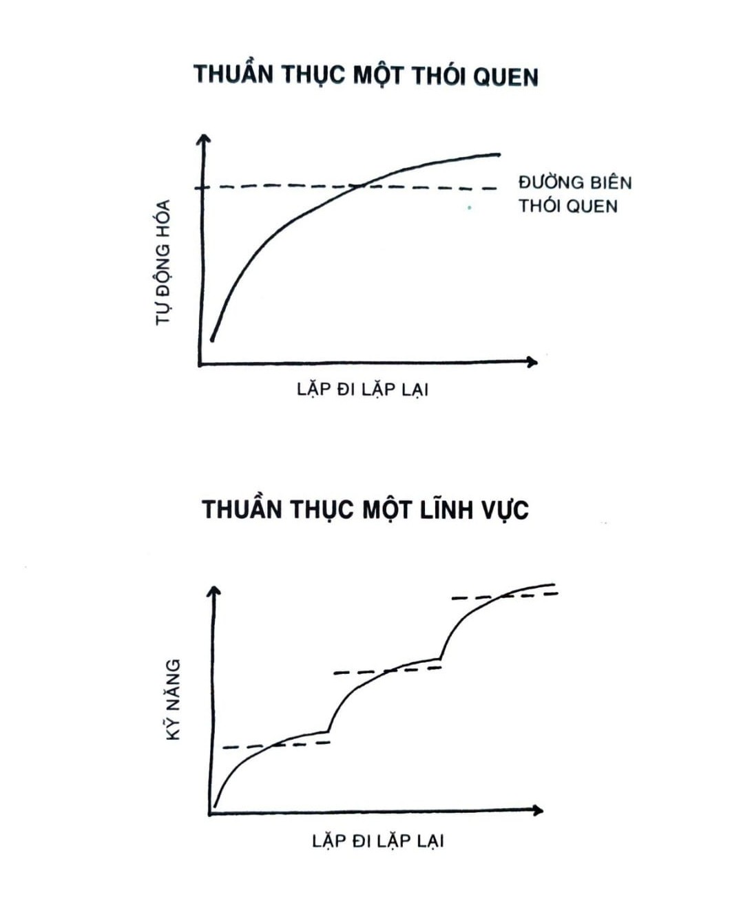

# CHƯƠNG 20: MẶT TRÁI CỦA THÓI QUEN TỐT

Thói quen đặt nền tảng cho sự tinh thông. Trong môn cờ nói chung, chỉ sau khi các nước đi cơ bản trở nên tự động thì người chơi cờ mới có thể tập trung vào cấp độ tiếp theo của trò chơi. Mỗi một mẩu thông tin được lưu vào bộ nhớ sẽ giải phóng không gian dành chỗ cho tư duy đòi hỏi sự cố gắng. Điều này đúng cho mọi nỗ lực. Khi bạn biết rành rẽ các bước đi đơn giản đến mức có thể thực hiện mà không cần suy nghĩ, thì bạn mới có chỗ để tập trung chú ý vào những chi tiết phức tạp hơn. Theo cách này, thói quen là xương sống cho bất kỳ hành trình vươn tới sự ưu tú nào.

Tuy vậy, lợi ích của thói quen đi kèm với một cái giá. Đầu tiên, mỗi một sự lặp đi lặp lại đều sẽ phát triển tính thông thạo, tốc độ và kỹ năng. Nhưng rồi khi thói quen trở nên tự động, bạn sẽ trở nên kém mẫn cảm với phản hồi. Bạn rơi vào vòng lặp vô thức. Sai sót trôi đi dễ dàng hơn nhiều. Khi bạn có thể làm “đủ tốt” trong chế độ lái tự động, thì bạn ngừng suy nghĩ đến việc làm sao để làm tốt hơn.

Mặt tốt của thói quen là ta có thể làm nhiều thứ không cần suy nghĩ. Mặt trái của thói quen là bạn trở nên quen thuộc với cách thức thực hiện việc gì đó đến mức bạn thôi không còn chú ý đến những sai sót nhỏ. Bạn mặc định rằng mình đang làm tốt hơn bởi vì mình đang tích lũy kinh nghiệm. Trong thực tế, bạn thuần túy chỉ đang củng cố thói quen hiện tại của mình - không phải đang cải thiện chúng. Một số nghiên cứu đã và đang chỉ ra rằng khi một kỹ năng đã được tinh thông, theo thời gian thường sẽ xuất hiện một sự đi xuống trong thành tích.

Thường thì sa sút nhỏ này không đáng lo ngại. Bạn không cần cả một hệ thống để liên tục cải thiện chất lượng đánh răng, hay thắt dây giày, hay pha một tách trà sáng. Với các thói quen như thế, vừa đủ tốt thường là đã đủ. Càng bớt sức lực bỏ vào các lựa chọn vụn vặt thì bạn càng có thể dành năng lượng cho những thứ thực sự quan trọng.

Tuy vậy, nếu bạn muốn tối đa hóa tiềm năng của mình và vươn tới tầm thành tích ưu tú, bạn cần một phương pháp tinh tế hơn. Bạn không thể mù quáng lặp đi lặp lại cùng một thứ và mong rằng mình sẽ vượt trội. Thói quen là cần thiết, nhưng không đủ để tinh thông. Cái bạn cần là một sự kết hợp giữa thói quen tự động và luyện tập có chủ đích. Thói quen + Luyện tập có chủ đích = Tinh thông

Để trở nên vĩ đại, một số kỹ năng nhất định cần trở nên tự động. Vận động viên bóng rổ phải đủ khả năng dẫn bóng mà không cần suy nghĩ trước khi họ có thể chuyển sang thuần thục lên rổ với tay không thuận của mình. Bác sĩ phẫu thuật cần phải lặp đi lặp lại thao tác rạch đường mổ đầu tiên đủ nhiều lần cho đến khi có thể nhắm mắt mà vẫn làm được, để họ có thể tập trung vào hàng trăm biến số khác có thể xảy đến trong ca mổ. Thế nhưng khi một thói quen đã được nhuần nhuyễn, bạn phải quay lại giai đoạn công việc đòi hỏi nỗ lực và bắt đầu xây dựng thói quen tiếp theo.

Sự tinh thông là quá trình thu hẹp sức tập trung vào một thành tố nhỏ xíu của thành công, lặp đi lặp lại nó cho đến khi bạn nhập nội được kỹ năng ấy, và sử dụng thói quen mới này làm nền tảng để vươn tới ranh giới phát triển của mình. Các nhiệm vụ cũ trở nên dễ dàng hơn vào lần hai, nhưng nhìn chung nó không dễ hơn được nữa bởi lúc này bạn đang đổ hết tinh lực vào thử thách tiếp theo. Mỗi thói quen sẽ mở ra một tầng thành tích mới. Đó là một chu kỳ vô tận.

Mặc dù thói quen có uy lực mạnh mẽ, nhưng cái bạn cần là làm sao bản thân giữ tỉnh táo về thành tích của mình theo thời gian, để bạn có thể tiếp tục điều chỉnh và cải thiện. Ngay đúng vào lúc bạn bắt đầu cảm thấy như mình đã thông thạo một kỹ năng - ngay khi có cảm giác như mọi chuyện đang được tự động hóa và bạn cảm thấy dễ chịu - thì bạn cần phải tránh bị rơi vào cái bẫy tự mãn.

Giải pháp? Đặt ra một hệ thống phản tư và tự đánh giá[^87].

*Hình 16: Quá trình tinh thông một điều gì đó đòi hỏi bạn tiến bộ dần dần theo từng lớp, hết một lớp lại đến một lớp khác, mỗi thói quen được xây trên cái trước đó cho đến khi chạm tới một cấp độ thành tích mới và một loạt thói quen mới được nhập nội hóa.*

## CÁCH ĐÁNH GIÁ THÓI QUEN CỦA MÌNH VÀ ĐIỀU CHỈNH

Vào năm 1986, đội Los Angeles Lakers sở hữu một trong những đội hình cầu thủ bóng rổ tài năng nhất từng tập hợp, nhưng họ hiếm khi được nhớ đến theo cách đó. Đội bóng bắt đầu mùa giải NBA năm 1985 - 1986 với kỷ lục 29-5 đáng kinh ngạc. “Các học giả nói rằng chúng tôi có lẽ là đội bóng giỏi nhất trong lịch sử bóng rổ”, huấn luyện viên trưởng Pat Riley phát biểu sau mùa giải. Ngạc nhiên là, đội Lakers rơi vào loạt trận play-off[^88] của mùa 1986 và hứng một trận thua cuối mùa giải trong Vòng Chung kết Western Conference. “Đội hình tốt nhất trong lịch sử bóng rổ” thậm chí còn không được thi đấu tranh chức vô địch NBA.

Sau cú sốc đó, Riley quá mệt mỏi với những chỉ trích đại loại như cầu thủ của ông đã từng xuất sắc thế nào và ông đã hứa hẹn ra sao. Ông không muốn thấy những ánh hào quang rực rỡ để rồi theo sau đó là phong độ sa sút. Ông muốn đội Lakers phải phát huy hết tiềm năng của mình, hằng đêm. Vào mùa hè năm 1986, ông lên một kế hoạch làm đúng như vậy, một hệ thống ông gọi là chương trình Nỗ Lực Tốt Nhất Trong Sự Nghiệp - Career Best Effort hay CBE.

“Khi cầu thủ vừa gia nhập Lakers”, Riley giải thích, “chúng tôi theo dõi các số liệu thống kê trong bóng rổ của họ ngược về những năm trung học. Tôi gọi đó là Thu Thập Số Liệu - Taking Their Number. Chúng tôi tìm kiếm chỉ số chính xác mà một cầu thủ có thể chơi, sau đó huấn luyện anh ấy theo kế hoạch của đội, dựa trên ý niệm anh sẽ duy trì được phong độ và cải thiện hơn mức trung bình của mình.”

Sau khi quyết định mức độ thành tích cơ sở của một cầu thủ, Riley sẽ thêm vào một bước then chốt. Ông yêu cầu mỗi vận động viên “cải thiện kết quả của mình ít nhất 1% trong suốt mùa giải. Nếu họ thành công, thì đó chính là CBE, hay Nỗ Lực Tốt Nhất Trong Sự Nghiệp”. Tương tự với đội đua xe đạp Anh, ta đã bàn trong Chương 1, đội Lakers tìm kiếm thành tích đỉnh cao bằng cách tiến bộ từng chút mỗi ngày.

Riley cẩn thận chỉ ra rằng CBE không chỉ là về số điểm hay con số thống kê, mà nó là về sự “nỗ lực tốt nhất về mặt tinh thần, tâm trí lẫn thể lực”. Cầu thủ nhận điểm tín nhiệm khi “thu hút một đối thủ chạy về phía mình dù biết là có thể mình sẽ bị phạm lỗi, nhoài người cứu bóng, hỗ trợ đồng đội khi đối thủ mà anh phải chắn cản đã vượt qua anh, và các hành động “anh hùng thầm lặng” khác.

Để minh họa, hãy xem như Magic Johnson - cầu thủ ngôi sao vào lúc bấy giờ - ghi được 11 điểm, 8 pha bắt bóng bật bảng[^89], 12 pha hỗ trợ, 2 cú cướp bóng, và 5 lần mất bóng trong một trận đấu. Magic còn có điểm tín nhiệm cho hành động “anh hùng thầm lặng” bằng việc nhoài người cứu bóng. Cuối cùng, anh đã chơi tổng cộng 33 phút trong trận đấu giả định này.

Số dương (11 + 8 + 12 + 2 + 1) tổng cộng là 34. Sau đó, ta trừ đi 5 lần mất bóng (34 - 5) còn 29. Cuối cùng, ta chia 29 cho 33 phút chơi. 29/33 = 0,879

Chỉ số CBE của Magic ở đây là 879. Con số này được tính toán cho mọi trận đấu mà một cầu thủ chơi, và là con số CBE trung bình mà cầu thủ được yêu cầu cải thiện 1% trong suốt mùa giải. Riley so sánh chỉ số CBE của mỗi cầu thủ không chỉ với thành tích quá khứ của họ mà còn với các cầu thủ khác trong liên đoàn. Như Riley giải thích, “Chúng tôi xếp hạng thành viên của đội bên cạnh các đấu thủ chơi cùng vị trí và có định nghĩa vai trò tương tự trong cả liên đoàn.”

Phóng viên thể thao Jackie MacMullan viết, “Riley công bố những cầu thủ hàng đầu trong liên đoàn mỗi tuần bằng chữ in đậm trên bảng đen và so sánh họ với các cầu thủ khác tương ứng trong danh sách. Những cầu thủ ổn định, đáng tin cậy thường sẽ đạt mức điểm tầm 600, trong khi các cầu thủ ưu tú đạt được ít nhất 800. Magic Johnson, người đã thực hiện được 138 cú triple-double[^90] trong toàn sự nghiệp của mình, thường đạt được trên 1.000 điểm.”

Đội Lakers cũng nhấn mạnh tiến bộ theo năm bằng các so sánh với dữ liệu CBE trong lịch sử. Riley nói, “Chúng tôi đặt tháng 11 năm 1986 cạnh tháng 11 năm 1985, và cho cầu thủ thấy họ đã làm được tốt hơn hay tệ hơn so với cùng thời điểm của mùa trước. Sau đó chúng tôi cho họ thấy số liệu thành tích của họ của tháng 12 năm 1986 được đặt cạnh số liệu của tháng 11.”

Đội Lakers công bố CBE vào tháng 10 năm 1986. Tám tháng sau, họ là nhà vô địch NBA. Năm tiếp theo, Riley dẫn dắt đội mình giành được một danh hiệu khác, đội Lakers trở thành đội đầu tiên trong 20 năm giành chức vô địch hai năm liên tiếp. Sau đó, ông nói, “Duy trì nỗ lực là điều quan trọng nhất trong mọi tổ chức. Cách để thành công là học được phương thức làm mọi thứ cho đúng, rồi sau đó làm y như vậy các lần sau.”

Chương trình CBE là ví dụ hoàn hảo cho sức mạnh của sự phản tư và tự đánh giá. Đội Lakers vốn sẵn tài năng. CBE chỉ giúp họ phát huy được hết tiềm năng họ có, và đảm bảo thói quen của họ cải tiến thay vì thoái lùi.

Phản tư và tự đánh giá tạo điều kiện cho mọi thói quen tiến bộ trong thời gian dài hạn, bởi nó giúp bạn ý thức được về sai lầm của mình và giúp bạn xem xét các con đường cải thiện khả dĩ. Không có phản tư, chúng ta sẽ viện cớ đổ lỗi, tự hợp lý hóa hành vi, và đánh lừa bản thân. Chúng ta không có quy trình giúp ta so sánh với ngày hôm qua và quyết định xem mình đang thể hiện tốt hơn hay tệ đi.

Những người thi đấu hay biểu diễn trong mọi lĩnh vực đều có cho mình nhiều dạng thức tự suy ngẫm và đánh giá, và quá trình này không nhất thiết phải phức tạp. Vận động viên điền kinh người Kenya Eliud Kipchoge là một trong những vận động viên marathon vĩ đại nhất mọi thời, cũng là người giành huy chương vàng Olympic. Mỗi buổi tập anh đều ghi chú lại các đánh giá về buổi luyện tập trong ngày, tìm kiếm các phần có thể cải thiện. Tương tự, huy chương vàng bơi lội Katie Ledecky ghi lại tình trạng sức khỏe của mình theo thang từ 1 đến 10, và kèm thêm ghi chú về chế độ dinh dưỡng cũng như chất lượng giấc ngủ của mình. Cô còn ghi lại thành tích thời gian của các vận động viên khác. Cuối mỗi tuần, huấn luyện viên của cô sẽ xem lại ghi chú của cô và bổ sung suy nghĩ của ông.

Không chỉ với vận động viên. Khi danh hài Chris Rock chuẩn bị chất liệu mới cho buổi diễn, trước đó anh sẽ biểu diễn trong các hộp đêm nhỏ hàng chục lần và thử nghiệm các mẩu chuyện. Anh sẽ đem lên sân khấu một tập giấy ghi chú và viết lại những mảng miếng gây cười và chỗ nào cần điều chỉnh. Những dòng đắt giá còn sót lại sẽ hình thành xương sống cho show trình diễn mới của anh.

Tôi biết một số nhà điều hành và đầu tư thường đem theo bên mình một cuốn “nhật ký quyết định”, trong đó họ ghi chú lại các quyết định quan trọng mà họ đưa ra mỗi tuần, vì sao quyết định như vậy, và họ kỳ vọng kết quả như thế nào. Họ đánh giá lại các quyết định này vào cuối mỗi tháng hay mỗi năm để xem họ đã làm đúng ở đâu và sai lầm ở chỗ nào.[^91]

Cải thiện không phải chỉ là câu chuyện về việc học thói quen mới, nó còn là chuyện tinh chỉnh thói quen. Phản tư và tự đánh giá đảm bảo bạn đã dành thời gian cho đúng việc và thực hiện chỉnh sửa khi cần - như Pat Riley điều chỉnh nỗ lực của các cầu thủ trên cơ sở hằng đêm. Bạn không nên giữ mãi một thói quen khi nó đã vô dụng.

Cá nhân tôi sử dụng hai hình thức phản tư và tự đánh giá chủ yếu. Tháng 12 mỗi năm, tôi thực hiện một Đánh giá Hằng năm, trong đó tôi suy ngẫm về năm vừa qua. Tôi đối chiếu thói quen trong năm bằng cách đếm xem mình đã viết được bao nhiêu bài, đã đến bao nhiêu buổi rèn luyện thân thể, đã thăm thú bao nhiêu nơi, v.v...[^92] Sau đó, tôi suy ngẫm về tiến bộ (hay thiếu sót) của mình bằng cách trả lời ba câu hỏi: 1. Năm nay mình đã làm tốt điều gì? 2. Năm nay mình chưa làm tốt điều gì? 3. Mình đã học được gì?

Sáu tháng sau, khi mùa hè đến, tôi sẽ viết một Báo cáo Trung thực. Như mọi người, tôi cũng phạm sai lầm. Báo cáo Trung thực sẽ giúp tôi nhận ra mình đã sai ở đâu và động viên tôi trở lại lộ trình. Tôi dùng nó như một cơ hội nhìn lại các giá trị cốt lõi và xem xem mình có đang sống với các giá trị này hay không. Đây là lúc tôi suy ngẫm về căn tính của mình và làm thế nào để tiếp tục nỗ lực trở thành kiểu người mình muốn trở thành.[^93]

Báo cáo Trung thực hằng năm sẽ trả lời ba câu hỏi: 1. Giá trị cốt lõi đang thúc đẩy cuộc sống và công việc của mình hiện nay là gì? 2. Mình có đang sống và làm việc trung thực ngay lúc này không? 3. Mình có thể đặt ra tiêu chuẩn cao hơn cho tương lai như thế nào?

Hai bản báo cáo này không tốn nhiều thời gian lắm - chỉ vài giờ mỗi năm - nhưng chúng là các thời điểm tinh chỉnh vô cùng trọng yếu. Chúng ngăn chặn các lơ là dần dần khi tôi không để tâm. Chúng là lời nhắc nhở hằng năm giúp tôi trở thành loại người mình mong muốn. Chúng chỉ ra cho tôi thấy khi nào mình cần nâng cấp thói quen của mình và chấp nhận các thách thức mới, cũng như khi nào mình cần tập trung sức lực của mình lại và tập trung vào các nền tảng trước.

Phản tư còn có thể cho ta cảm giác toàn cảnh. Thói quen hằng ngày có tác dụng lớn theo cách nó cộng gộp, thế nhưng lo lắng quá nhiều về các lựa chọn thường nhật thì tựa như đang gí mặt mình vào gương mà quan sát. Bạn có thể thấy mọi chi tiết nhỏ nhặt và đánh mất bức tranh lớn hơn. Như thế thì quá nhiều phản hồi. Ngược lại, không bao giờ đánh giá thói quen cũng giống như không bao giờ soi gương. Bạn không nhận thức được các sơ sót có thể sửa chữa được dễ dàng - một đốm dơ trên áo, hay một mẩu thức ăn dính vào răng. Như vậy thì quá ít phản hồi. Phản tư và tự đánh giá định kỳ thì giống như khi bạn soi gương từ khoảng cách của một cuộc trò chuyện. Bạn thấy được các thay đổi quan trọng cần phải thực hiện mà không đánh mất cái nhìn toàn cảnh. Bạn nên nhìn cả rặng núi, đừng quá bận tâm với từng đỉnh núi hay thung lũng.

Sau rốt, phản tư và tự đánh giá cho bạn một cơ hội lý tưởng để nhìn lại một trong những khía cạnh quan trọng nhất của thay đổi hành vi: Căn tính.

## PHÁ BỎ NIỀM TIN ĐANG KIỀM CHÂN BẠN

Lúc ban đầu, lặp đi lặp lại một thói quen là vô cùng cần thiết cho việc tích lũy bằng chứng cho căn tính mong muốn. Tuy vậy, khi bạn đã gắn bó với căn tính mới này rồi, các niềm tin ấy có thể níu chân bạn tiến triển lên tầm cao hơn. Khi chống lại bạn, căn tính sẽ tạo ra một “niềm kiêu hãnh” khuyến khích bạn phớt lờ các điểm yếu và ngăn bạn thực sự tiến lên. Đây là một trong các mặt trái của việc xây dựng thói quen.

Một ý niệm càng thiêng liêng với ta bao nhiêu - nghĩa là, nó càng gắn chặt vào căn tính của ta bao nhiêu - thì ta bảo vệ nó trước công kích càng mạnh mẽ. Bạn sẽ thấy điều này trong mọi ngành nghề. Người giáo viên từ chối các phương pháp dạy học tân tiến và bám chặt vào giáo án đã qua kiểm chứng của mình. Nhà quản lý cựu chiến binh kiên quyết làm mọi thứ “theo cách của mình”. Viên bác sĩ phủ quyết các ý kiến của người đồng sự trẻ hơn. Ban nhạc ra mắt được một album tạo được tiếng vang lớn và rồi đi vào lối mòn. Chúng ta càng bám chặt vào một căn tính, thì nó càng vững chắc đến mức rất khó cho ta vượt qua.

Có một giải pháp là tránh để cho bất kỳ khía cạnh nào trong căn tính trở thành phần áp đảo con người bạn. Theo lời nhà đầu tư Paul Graham, “Giữ căn tính của bạn nhỏ thôi.” Bạn càng để cho một niềm tin định hình mình nhiều bao nhiêu thì bạn càng ít có khả năng thích nghi khi cuộc sống biến thiên quanh bạn. Nếu bạn dồn mọi thứ bạn có vào vị trí hậu vệ dẫn bóng, hay vào một đối tác ở công ty, hay bất cứ điều gì, thì khi điều đó mất đi, bạn sẽ sụp đổ. Nếu bạn là người ăn chay rồi sau đó mắc phải một vấn đề về sức khỏe buộc bạn phải thay đổi chế độ ăn của mình, bạn sẽ gặp khủng hoảng căn tính. Khi bạn bám quá chặt vào một căn tính, bạn trở nên dễ vỡ. Mất một thứ và bạn đánh mất cả bản thân mình.

Trong phần lớn khoảng thời gian thanh thiếu niên, trở thành một vận động viên là một phần chính yếu trong căn tính của tôi. Khi sự nghiệp bóng chày kết thúc, tôi đã phải vất vả đi tìm lại bản thân. Khi bạn dành toàn bộ cuộc sống của mình để định nghĩa mình theo một cách, thì lúc nó không còn nữa, bạn là ai lúc này?

Các cựu chiến binh và các doanh nhân về hưu cho thấy các cảm giác tương tự. Khi căn tính của bạn gói gọn trong một niềm tin như “Tôi là một người lính vĩ đại”, thì khi không còn tại ngũ, chuyện gì sẽ xảy ra? Với nhiều chủ doanh nghiệp, căn tính của họ sẽ đâu đó đại ý như “Tôi là một CEO” hay “Tôi là nhà sáng lập”. Nếu bạn dành từng phút giây trong đời sống khi thức của mình cho công ty, vậy bạn sẽ thấy thế nào sau khi bán nó đi?

Chìa khóa làm dịu bớt sự mất mát căn tính là tái định nghĩa bản thân theo cách giữ lại các khía cạnh quan trọng của căn tính ngay cả khi vai trò nào đó của bạn thay đổi. “Tôi là một vận động viên” trở thành “Tôi là kiểu người có tinh thần kiên cường và thích các thử thách về thể chất”. “Tôi là một người lính vĩ đại” trở thành “Tôi là kiểu người kỷ luật, đáng tin cậy và làm việc đội nhóm tốt”. “Tôi là một CEO” trở thành “Tôi là kiểu người xây dựng và kiến tạo”.

Khi được lựa chọn hiệu quả, một căn tính có thể linh hoạt thay vì dễ gãy vỡ. Như nước lượn quanh một trở vật, căn tính của bạn sẽ hợp tác với hoàn cảnh thay đổi thay vì chống lại chúng.

Đoạn trích sau đây từ Đạo đức kinh bao hàm hoàn hảo ý tưởng trên: Người sinh ra thì mềm yếu, Chết đi thì cứng chắc. Cây cỏ sinh ra thì mềm dẻo, Chết đi thì khô giòn. Cho nên tính cứng nhắc thiếu linh hoạt Đồng hành cùng cái chết. Tính mềm dẻo linh hoạt Đồng hành cùng sự sống. Cứng chắc sẽ gãy. Còn mềm dẻo sẽ thắng thế. - Lão Tử

Thói quen cho ta rất nhiều lợi ích, nhưng mặt trái là chúng có thể trói buộc ta vào mô thức suy nghĩ và hành động cũ ngay cả khi thế giới đang biến chuyển xung quanh. Không có gì là tồn tại mãi mãi. Cuộc sống thay đổi không ngừng, cho nên bạn cần phải định kỳ kiểm tra xem các thói quen và niềm tin cũ có còn đang phục vụ cho lợi ích của mình hay không.

Thiếu sự tự nhận thức là độc dược, mà phản tư và tự đánh giá chính là thuốc giải.

## Tóm tắt chương

- Mặt tốt của thói quen là ta có thể làm nhiều thứ không cần suy nghĩ. Mặt trái là ta thôi không còn chú ý đến những sai sót nhỏ.

- Thói quen + Luyện tập có chủ đích = Tinh thông.

- Phản tư và tự đánh giá là một quy trình giúp bạn luôn ý thức về thành tích của mình theo thời gian.

- Chúng ta càng bám chặt vào một căn tính, thì nó càng vững chắc đến mức rất khó cho ta vượt qua.

---

## Chú thích

[^87]: Reflection and review.

[^88]: Play-off là trận đấu quyết định tranh một suất cuối cùng vào vòng tiếp theo của một giải đấu thể thao, cho biết đội bóng nào sẽ được đi tiếp và đội bóng nào sẽ phải ở lại. Nguồn: Wikipedia. (ND)

[^89]: Rebound.

[^90]: Triple-double là thành tích dành cho các cá nhân thực hiện được 3 chỉ số trên 10 trong số 5 lĩnh vực của bóng rổ là ghi điểm, assist (hỗ trợ), rebound (bắt bóng bật bảng), block (cản bóng) và steal (cướp bóng). Nguồn: http://webthethao.vn. (ND)

[^91]: Tôi có tạo một biểu mẫu nhật ký quyết định cho các độc giả quan tâm. Nó là một phần của nhật ký thói quen ở trang atomichabits.com/journal. (TG)

[^92]: Bạn có thể xem Đánh giá Hằng năm các năm trước của tôi tại jamesclear.com/ annual-review. (TG)

[^93]: Bạn có thể xem Báo cáo Trung thực các năm trước của tôi tại jamesclear.com/integrity. (TG)
