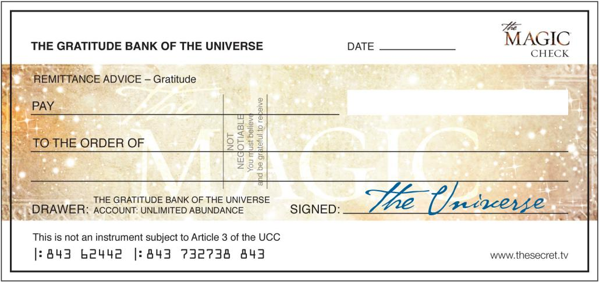

# Ngày 17: Tấm Séc Ma Thuật

> *“Trong vũ trụ ma thuật không có sự trùng hợp ngẫu nhiên và không có sự tình cờ. Không có gì xảy ra mà không có ai đó muốn nó xảy xa.”*
>
> WILLIAM S. BURROUGHS (1914-1997)  
> NHÀ VĂN VÀ NHÀ THƠ

Khi bạn hướng sức mạnh ma thuật của sự biết ơn vào bất kỳ một tình huống tiêu cực nào, một tình huống *mới* được tạo ra, triệt tiêu tình huống cũ. Điều đó có nghĩa là khi bạn đưa bản thân mình tới nơi mà bạn thấy biết ơn cho tiền bạc hơn là bạn thấy thiếu tiền, một tình huống mới được tạo ra, triệt tiêu tình trạng thiếu tiền và thay thế cho điều đó bằng nhiều tiền hơn một cách ma thuật.

Tất cả những cảm xúc tồi tệ về tiền thì đẩy tiền ra xa bạn và làm giảm đi tiền bạc trong cuộc sống của bạn, và bất cứ lúc nào bạn cảm thấy khổ sở về tiền thì bạn đang làm giảm tiền thêm một chút. Nếu bạn có những cảm nhận về tiền như đố kỵ, thất vọng, lo lắng, hay sợ hãi, bạn không thể có nhiều hơn được. Luật hấp dẫn nói rằng những gì giống nhau thì hút nhau, cho nên nếu bạn cảm thấy thất vọng vì không có đủ tiền thì bạn sẽ được nhận nhiều hơn những tình huống đáng thất vọng về việc không có đủ tiền. Nếu bạn lo lắng về tiền bạc bạn sẽ nhận thêm những tình huống lo lắng về tiền. Nếu bạn thấy sợ hãi về tiền bạc thì bạn lại nhận thêm nhiều tình huống tiếp tục làm cho bạn sợ hãi về tiền.

Dù cho có khó khăn thế nào, bạn vẫn phải lờ đi tình hình hiện tại và bất kỳ sự thiếu tiền nào bạn có thể đang có, và sự biết ơn là cách được bảo đảm để bạn làm điều đó. Bạn không thể biết ơn cho tiền và thất vọng vì tiền cùng một lúc được. Cũng như bạn không thể vừa biết ơn tiền và có những suy nghĩ sợ hãi về tiền đồng thời. Khi bạn biết ơn tiền, không những bạn chấm dứt những suy nghĩ và cảm xúc tiêu cực về tiền làm cho tiền đi xa bạn mà bạn đang làm những điều thực sự giúp mang tiền về cho bạn nhiều hơn!

Bạn đã thực hành biết ơn cho số tiền bạn đã nhận được và đang tiếp tục nhận. Cho nên, trước khi bạn sử dụng sức mạnh ma thuật cho số tiền bạn muốn, bạn phải hiểu những cách thức và con đường khác nhau mà tiền bạc hay sự giàu có đến với đời bạn. Bởi vì nếu bạn không biết ơn mỗi lần sự giàu có hay tiền bạc tăng lên, bạn sẽ cắt đi dòng chảy sung túc đến với bạn.

Tiền bạc có thể đến với bạn qua việc nhận một tấm séc ngoài mong đợi, một sự tăng lương, một sự trúng số, khoản hoàn thuế, hay là một món quà hoặc số tiền bất ngờ từ người nào đó. Tiền của bạn cũng có thể tăng khi ai đó tự ý trả tiền cà phê, ăn trưa, hay ăn tối, khi bạn đang chuẩn bị mua một món đồ và bạn nhận ra là nó vừa được giảm giá, khi có một khoản tiền được trả lại trong một giao dịch, hoặc khi ai đó tặng bạn một món quà hay một thứ mà bạn cần mua. Kết quả cuối cùng của bất cứ tình huống nào trên đây chính là bạn có thêm tiền! Cho nên bất cứ khi nào một tình huống như vậy phát sinh, hãy hỏi chính bạn: liệu tình huống này có ý nghĩa là mình đang có thêm tiền không? Bởi vì nếu là vậy, bạn phải rất biết ơn cho số tiền bạn nhận được trong tình huống đó!

Nếu bạn kể cho một người bạn là bạn đang định mua một món đồ và người bạn đề nghị cho bạn mượn hay cho bạn đúng món đồ đó vì họ không sử dụng, hay là bạn đang lên kế hoạch để đi du lịch và bạn nghe về một ưu đãi đặc biệt mà cuối cùng bạn được nhận, hoặc nếu tổ chức tín dụng giảm mức lãi vay xuống, hoặc một nhà cung cấp dịch vụ đề nghị bạn một gói dịch vụ tốt hơn nhiều, tiền của bạn sẽ tăng lên một cách thần kỳ thông qua việc tiết kiệm tiền. Bạn có thấy rằng có không giới hạn những tình huống mà bạn nhận được tiền?

Rất có khả năng khi bạn trải nghiệm những tình huống này trong quá khứ, và dù cho bạn có nhận ra hay không vào thời điểm đó, chúng xảy ra là vì bạn hấp dẫn chúng. Nhưng khi sự biết ơn đi vào cuộc sống của bạn, bạn luôn thu hút những tình huống ma thuật! Nhiều người gọi đó là vận may, nhưng đó hoàn toàn không phải là vận may; đó chính là luật Vũ trụ.

Bất kỳ tình huống nào dẫn đến kết quả là bạn có thêm tiền hay nhận được thứ phải tốn tiền để mua là kết quả của sự biết ơn *của bạn*. Bạn sẽ cảm thấy vô cùng vui sướng khi biết rằng bạn đã làm điều đó, và khi bạn kết hợp niềm vui của mình với sự biết ơn, bạn có một lực hấp dẫn thật sự để tiếp tục thu hút sự sung túc nhiều và nhiều hơn nữa.

Khi tôi đến Mỹ vài năm trước, tôi đến với hai cái vali. Tôi làm việc trong một căn hộ sơ sài với máy tính đặt trong lòng. Tôi không có xe, và tôi hầu như là đi bộ đến tất cả mọi nơi. Nhưng tôi biết ơn cho tất cả mọi thứ. Tôi biết ơn cho việc đang ở nước Mỹ, tôi biết ơn cho công việc tôi đang làm, tôi biết ơn cho căn hộ sơ sài với bốn cái đĩa, bốn con dao, bốn cái nĩa, và bốn cái muỗng. Tôi biết ơn là tôi có thể cuốc bộ đến hầu hết mọi nơi, và tôi biết ơn rằng có một chỗ đậu xe taxi ngay phía bên kia đường. Rồi có vài điều không thể tin được xảy ra – một người mà tôi biết đã quyết định tặng cho tôi một tài xế và một chiếc xe trong vài tháng. Ngoài cái máy tính, tôi đang sống với những thứ đồ đạc cơ bản nhất để tồn tại, và rồi đột nhiên tôi có tài xế và xe riêng! Tôi đã biết ơn và tôi đã được cho thêm. Và đó chính xác là cách ma thuật xảy ra với sự biết ơn.

Bài tập ma thuật hôm nay cho tiền bạc bạn muốn nhận đã mang lại kết quả sửng sốt cho nhiều người. Vào cuối bài tập bạn sẽ thấy một Tấm Séc Ma Thuật trống từ Ngân Hàng Biết Ơn của Vũ Trụ, và bạn sẽ tự mình viết vào Tấm Séc Ma Thuật. Hãy điền số tiền bạn muốn nhận, cùng với tên bạn và ngày hôm nay. Hãy chọn một số tiền riêng biệt cho một thứ mà bạn *thật sự* muốn, bởi vì bạn có thể thấy biết ơn nhiều hơn cho tiền bạc khi bạn biết những gì bạn dự định tiêu tiền vào. Tiền bạc là phương tiện cho những gì bạn muốn, nhưng nó không phải là kết quả cuối cùng, cho nên nếu bạn chỉ nghĩ về tiền tự thân nó thì bạn sẽ không thể cảm nhận thấy biết ơn thật nhiều được. Khi bạn hình dung việc nhận được điều bạn *thật sự* muốn, hay là làm điều bạn *thật sự* muốn làm, bạn sẽ thấy biết ơn hơn rất nhiều việc bạn chỉ biết ơn cho tiền.

Bạn có thể photo hoặc scan lại Tấm Séc Ma Thuật từ quyển sách này. Bạn cũng có thể lấy rất nhiều Tấm Séc Ma Thuật trống từ: www.thesecret.tv/magiccheck.

Nếu muốn thì bạn có thể bắt đầu với một số tiền nhỏ hơn trong đầu tiên của mình, và sau khi bạn nhận được số tiền nhỏ hơn, bạn có thể tiếp tục gia tăng số tiền trong những tấm séc kế tiếp. Lợi ích của việc bắt đầu với số tiền nhỏ là khi bạn nhận được nó một cách ma thuật thì bạn sẽ biết rằng *bạn* làm được, bạn sẽ biết một cách tuyệt đối rằng ma thuật của sự biết ơn đã hoạt động, và sự biết ơn và niềm vui bạn cảm thấy sẽ tạo ra một niềm tin lớn hơn trong bạn.

Một khi bạn đã điền chi tiết vào Tấm Séc Ma Thuật, hãy cầm tấm séc trong tay và nghĩ về một điều cụ thể bạn muốn có tiền cho điều đó. Hãy tạo một hình ảnh trong tâm trí và hình dung bản thân bạn thực sự sử dụng tiền để có thứ bạn thực sự muốn đó, và đặt càng nhiều sự phấn khích và biết ơn vào điều đó càng tốt.

Có thể bạn muốn số tiền cho một đôi giày mới, máy tính mới, hay một cái giường mới, hãy hình dung bạn đang thật sự mua thứ mình muốn trong cửa hàng. Nếu bạn mua online, hãy hình dung mình đang nhận hàng vận chuyển đến, rồi bạn cảm thấy phấn khích và biết ơn. Bạn có thể muốn có tiền để đi du lịch nước ngoài, hay là để đóng học phí đại học cho con mình, hãy hình dung việc mua vé máy bay hay là mở một tài khoản ngân hàng để đóng học phí. Và hãy cảm nhận hạnh phúc và biết ơn như thể bạn đã thực sự nhận được rồi!

Sau khi bạn hoàn thành những bước này, hãy cầm Tấm Séc Ma Thuật theo hôm nay, hay đặt nó tại một nơi bạn thấy thường xuyên. Vào ít nhất hai lần nữa trong ngày hôm nay hãy cầm Tấm Séc Ma Thuật trong tay, hình dung bản thân bạn đang sử dụng tiền cho những gì bạn muốn, và cảm thấy càng biết ơn và hưng phấn càng tốt, như thể bạn đã thực sự làm điều đó. Nếu muốn bạn có thể làm điều đó nhiều lần hơn trong ngày. Cũng như với những bài tập ma thuật khác, bạn không thể làm bài tập quá nhiều được.

Vào cuối ngày, hãy giữ Tấm Séc Ma Thuật ở nơi bạn có nó, hay đặt nó ở một nơi lâu dài khác, nơi mà bạn có thể thấy nó mỗi ngày. Bạn có thể đặt nó lên tấm gương trong phòng tắm, tủ lạnh, dưới Hòn Đá Ma Thuật, trong xe hay trong ví, hay là dưới máy vi tính. Bất cứ lúc nào bạn thấy Tấm Séc Ma Thuật, hãy cảm nhận như là bạn đã nhận được tiền, và hãy biết ơn rằng bây giờ bạn có thể có hay làm những điều bạn muốn.

Khi bạn đã nhận được số tiền trong Tấm Séc Ma Thuật, hoặc nếu bạn nhận được món đồ bạn muốn tiêu tiền theo một cách thức ma thuật, hãy thay thế tấm séc với một con số mới cho món khác mà bạn *thực sự* muốn, và tiếp tục với bài tập Tấm Séc Ma Thuật miễn là bạn vẫn muốn.

## BÀI TẬP MA THUẬT SỐ 17

### Tấm Séc Ma Thuật

1. Đếm Những Phúc Lành: lập danh sách mười điều được ban ơn. Viết ra *tại sao* bạn lại biết ơn. Đọc lại danh sách, và vào cuối mỗi phúc lành hãy nói *cảm ơn, cảm ơn, cảm ơn,* và cảm nhận biết ơn nhiều nhất có thể cho những phúc lành này.

2. Điền vào Tấm Séc Ma Thuật số tiền bạn muốn nhận, cùng với tên bạn và ngày tháng.

3. Cầm Tấm Séc Ma Thuật trong tay, và tưởng tượng việc mua một thứ cụ thể bạn muốn với số tiền đó. Hãy cảm nhận hạnh phúc và biết ơn càng nhiều càng tốt như là bạn đã nhận được rồi.

4. Mang Tấm Séc Ma Thuật theo bạn hôm nay, hoặc đặt nó tại một nơi bạn nhìn thường xuyên. Ít nhất là **hai** lần nữa trong ngày, cầm tấm séc trong tay, hình dung bạn đang sử dụng tiền để mua thứ mình muốn, và cảm nhận biết ơn như thể bạn đang thực sự làm điều đó.

5. Vào cuối ngày, hãy giữ Tấm Séc Ma Thuật tại một nơi lâu dài mà bạn thấy mỗi ngày. Khi bạn đã nhận được số tiền từ tờ séc, hoặc khi bạn nhận được món đồ bạn muốn tiêu tiền, hãy thay tấm séc với con số mới cho cái khác bạn muốn, và lặp lại bước 2-4.

6. Ngay trước khi đi ngủ tối nay, hãy nắm Hòn Đá Ma Thuật trong tay, và nói từ ma thuật, *cảm ơn,* cho điều *tốt nhất* đã xảy ra trong ngày.

Photocopy hay scan tấm séc, rồi điền vào ngày tháng, tên bạn, và số tiền bạn mong muốn nhận với loại tiền bạn muốn.

