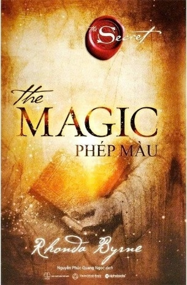

# The Magic (Phép Màu) - Rhonda Byrne

**Tác giả:** Rhonda Byrne  
**Dịch giả:** Nguyễn Văn Thảo  
**Thể loại:** Triết lý sống & Tỉnh thức  

---

## Mục Lục

- [The Magic](00-the-magic.md)
- [Lời dịch giả](01-loi-dich-gia.md)
- [Lời cảm ơn](02-loi-cam-on.md)
- [Bạn có tin vào phép thuật?](03-ban-co-tin-vao-phep-thuat.md)
- [Một phép thuật vĩ đại được tiết lộ](04-mot-phep-thuat-vi-dai-duoc-tiet-lo.md)
- [Mang phép thuật vào cuộc sống của bạn](05-mang-phep-thuat-vao-cuoc-song-cua-ban.md)
- [Một quyển sách ma thuật](06-mot-quyen-sach-ma-thuat.md)
- [Ngày 1: Đếm Những Phúc Lành Của Bạn](07-ngay-01-dem-nhung-phuc-lanh-cua-ban.md)
- [Ngày 2: Hòn Đá Ma Thuật](08-ngay-02-hon-da-ma-thuat.md)
- [Ngày 3: Những Mối Quan Hệ Ma Thuật](09-ngay-03-nhung-moi-quan-he-ma-thuat.md)
- [Ngày 4: Sức Khỏe Ma Thuật](10-ngay-04-suc-khoe-ma-thuat.md)
- [Ngày 5: Tiền Bạc Ma Thuật](11-ngay-05-tien-bac-ma-thuat.md)
- [Ngày 6: Làm Việc Như Ma Thuật](12-ngay-06-lam-viec-nhu-ma-thuat.md)
- [Ngày 7: Loại Bỏ Tiêu Cực Ma Thuật](13-ngay-07-loai-bo-tieu-cuc-ma-thuat.md)
- [Ngày 8: Nguyên Liệu Ma Thuật](14-ngay-08-nguyen-lieu-ma-thuat.md)
- [Ngày 9: Ma Thuật Tiền Bạc](15-ngay-09-ma-thuat-tien-bac.md)
- [Ngày 10: Bụi Ma Thuật Cho Mọi Người](16-ngay-10-bui-ma-thuat-cho-moi-nguoi.md)
- [Ngày 11: Một Buổi Sáng Ma Thuật](17-ngay-11-mot-buoi-sang-ma-thuat.md)
- [Ngày 12: Con Người Ma Thuật Tạo Ra Sự Thay Đổi](18-ngay-12-con-nguoi-ma-thuat-tao-ra-su-thay-doi.md)
- [Ngày 13: Làm Cho Tất Cả Những Ước Mơ Của Bạn Trở Thành Sự Thật](19-ngay-13-lam-cho-tat-ca-nhung-uoc-mo-cua-ban-tro-thanh-su-that.md)
- [Ngày 14: Hưởng Một Ngày Ma Thuật](20-ngay-14-huong-mot-ngay-ma-thuat.md)
- [Ngày 15: Chữa Lành Những Mối Quan Hệ Một Cách Ma Thuật](21-ngay-15-chua-lanh-nhung-moi-quan-he-mot-cach-ma-thuat.md)
- [Ngày 16: Ma Thuật Và Phép Màu Trong Sức Khỏe](22-ngay-16-ma-thuat-va-phep-mau-trong-suc-khoe.md)
- [Ngày 17: Tấm Séc Ma Thuật](23-ngay-17-tam-sec-ma-thuat.md)
- [Ngày 18: Danh Sách Việc Cần Làm Ma Thuật](24-ngay-18-danh-sach-viec-can-lam-ma-thuat.md)
- [Ngày 19: Những Bước Đi Ma Thuật](25-ngay-19-nhung-buoc-di-ma-thuat.md)
- [Ngày 20: Ma Thuật Trái Tim](26-ngay-20-ma-thuat-trai-tim.md)
- [Ngày 21: Những Kết Quả Tuyệt Vời](27-ngay-21-nhung-ket-qua-tuyet-voi.md)
- [Ngày 22: Ngay Trước Mắt Bạn](28-ngay-22-ngay-truoc-mat-ban.md)
- [Ngày 23: Không Khí Ma Thuật Mà Bạn Thở](29-ngay-23-khong-khi-ma-thuat-ma-ban-tho.md)
- [Ngày 24: Chiếc Đũa Thần](30-ngay-24-chiec-dua-than.md)
- [Ngày 25: Gợi Ý Ma Thuật](31-ngay-25-goi-y-ma-thuat.md)
- [Ngày 26: Chuyển Đổi Lỗi Lầm Thành Phúc Lành Một Cách Ma Thuật](32-ngay-26-chuyen-doi-loi-lam-thanh-phuc-lanh-mot-cach-ma-thuat.md)
- [Ngày 27: Tấm Gương Ma Thuật](33-ngay-27-tam-guong-ma-thuat.md)
- [Ngày 28: Ghi Nhớ Ma Thuật](34-ngay-28-ghi-nho-ma-thuat.md)
- [Tương lai ma thuật của bạn](35-tuong-lai-ma-thuat-cua-ban.md)
- [Ma thuật không bao giờ kết thúc](36-ma-thuat-khong-bao-gio-ket-thuc.md)
- [Về Rhonda Byrne](37-ve-rhonda-byrne.md)
- [Lời cuối sách](38-loi-cuoi-sach.md)
